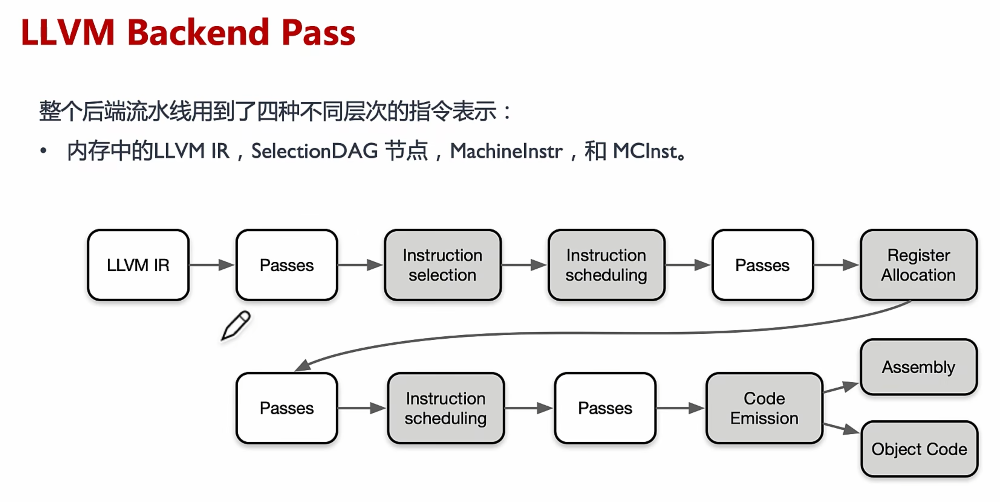

## Tradition

### 1.编译器与解释器

编译器（Compiler）和解释器（Interpreter）是两种不同的工具，都可以将编程语言和脚本语言转换为机器语言。虽然两者都是将高级语言转换成机器码，但是其最大的区别在于：**解释器在程序运行时将代码转换成机器码，编译器在程序运行之前将代码转换成机器码**。

> 机器语言：机器语言程序是由一系列二进制模式组成的（例如110110），表示应该由计算机执行的简单操作。机器语言程序是可执行的，所以可以直接在硬件上运行。

#### 1.1 编译器 Compiler

编译器可以将整个程序转换为目标代码(object code)，这些目标代码通常存储在文件中。目标代码也被称为二进制代码，在进行链接后可以被机器直接执行。典型的编译型程序语言有C和C++。

1. 编译器读取源程序代码，输出可执行机器码，即把开发者编写的代码转换成 CPU 等硬件能理解的格式
2. 将输入源程序转换为机器语言或低级语言，并在执行前并报告程序中出现的错误
3. 编译的过程比较复杂，会消耗比较多的时间分析和处理开发者编写的程序代码
4. 可执行结果，属于某种形式的特定于机器的二进制代码

目前主流如 LLVM 和 GCC 等经典的开源编译器的类型分为前端编译器、中间层编译器、后端编译器。1）编译器的分析阶段也称为前端编译器，将程序划分为基本的组成部分，检查代码的语法、语义和语法，然后生成中间代码。2）中间层主要是对源程序代码进行优化和分析，分析阶段包括词法分析、语义分析和语法分析；优化主要是优化中间代码，去掉冗余代码、子表达式消除等工作。3）编译器的合成阶段也称为后端，针对具体的硬件生成目标代码，合成阶段包括代码优化器和代码生成器。

#### 1.2 解释器 Interpreter

解释器能够直接执行程序或脚本语言中编写的指令，而不需要预先将这些程序或脚本语言转换成目标代码或者机器码。典型的解释型语言有 Python、PHP 和 Matlab。

1. 将一个用高级语言编写的程序代码翻译成机器级语言
2. 解释器在运行时，逐行转换源代码为机器码
3. 解释器允许在程序执行时，求值和修改程序
4. 用于分析和处理程序的时间相对较少
5. 与编译器相比，程序执行相对缓慢

两者最大的差别在于编译器将一个程序作为一个整体进行翻译，而解释器则一条一条地翻译一个程序。编译器的情况下生成中间代码或目标代码，而解释器不创建中间代码。在执行效率上，编译器比解释器要快得多，因为编译器一次完成整个程序，而解释器则是依次编译每一行代码，非常的耗时。从资源占用方面来看，由于要生成目标代码，编译器比解释器需要更多的内存。

### 2.JIT和AOT编译方式

目前，程序主要有两种运行方式：**静态编译**和**动态解释**。

- **静态编译**的代码程序在执行前全部被翻译为机器码，通常将这种类型称为 AOT（Ahead of time），即“提前编译”；

- **动态解释**的程序则是对代码程序边翻译边运行，通常将这种类型称为 JIT（Just in time），即“即时编译”。

AOT 程序的典型代表是用 C/C++ 开发的应用，其必须在执行前编译成机器码，然后再交给操作系统具体执行；而 JIT 的代表非常多，如 JavaScript、Python 等动态解释的程序。

事实上，所有脚本语言都支持 JIT 模式。但需要注意的是 JIT 和 AOT 指的是程序运行方式，和编程语言本身并非强关联的，有的语言既可以以 JIT 方式运行也可以以 AOT 方式运行，如 Java 和 Python。它们可以在第一次执行时编译成中间字节码，之后就可以直接执行字节码。只要需要编译，无论其编译产物是字节码还是机器码，都属于 AOT 的方式。

下面是 JIT 和 AOT 两种编译方式的优点对比。在 JIT 中其优点为：

1. 可以根据当前硬件情况实时编译生成最优机器指令
2. 可以根据当前程序的运行情况生成最优的机器指令序列
3. 当程序需要支持动态链接时，只能使用JIT的编译方式
4. 可以根据进程中内存的实际情况调整代码，使内存能够更充分的利用

但是 JIT 缺点也非常明显：

1. 编译需要占用运行时Runtime的资源，会导致进程执行时候卡顿
2. 编译占用运行时间，对某些代码编译优化不能完全支持，需在流畅和时间权衡
3. 在编译准备和识别频繁使用的方法需要占用时间，初始编译不能达到最高性能

相对而言，JIT 的缺点也是 AOT 的优点所在：

1. 在程序运行前编译，可以避免在运行时的编译性能消耗和内存消耗
2. 可以在程序运行初期就达到最高性能
3. 可以显著加快程序的执行效率

其 AOT 的优点之下，也会带来一些问题：

1. 在程序运行前编译会使程序安装的时间增加
2. 将提前编译的内容保存起来，会占用更多的内存
3. 牺牲高级语言的一致性问题

目前主流的 AI 框架，都会带有前端的表达层，再加上 AI 编译器对硬件使能，因此 AI 框架跟 AI 编译器之间关系非常紧密，部分如 MindSpore、TensorFlow 等 AI 框架中默认包含了自己的 AI 编译器。目前 PyTorch2.X 版本升级后，也默认自带 Inductor 功能特性，可以对接多个不同的 AI 编译器。

如**静态编译**的代码程序在执行前全部被翻译为机器码，这种 AOT（Ahead of time），即提前编译的方式，AOT 更适合移动、嵌入式深度学习应用。在 MLIR + TensorFLow 框架中目前支持 AOT 和 JIT 的编译方式，不过在 AI 领域，目前 AOT 的典型代表有：

1）推理引擎，在训练的之后 AI 编译器把网络模型提前固化下来，然后在推理场景直接使用提前编译好的模型结构，进行推理部署；

2）静态图生成，通过 AI 编译器对神经网络模型表示称为统一的 IR 描述，接着在真正运行时执行编译后的内容。

另一方面，**动态解释**的程序则是对代码程序边翻译边运行，称为 JIT（Just in time），即即时编译。典型的代表有：

1）PyTorch 框架中的 JIT 特性，可以将 Python 代码实时编译成本地机器代码，实现对深度学习模型的优化和加速。

2）清华发布的计图（Jittor），完全基于动态编译JIT，内部使用创新的元算子和统一计算图的深度学习框架，元算子和Numpy一样易于使用，并且超越Numpy能够实现更复杂更高效的操作。基于元算子开发的深度学习模型，可以被计图实时的自动优化并且运行在指定的硬件上。

### 3.Pass和中间表示IR

编译器是提高开发效率的工具链中不可或缺的部分，但编译器被很多程序员和开发者视为黑箱，输入高层次的源程序，产生语义不变的低层次机器码。此时，编译器的内部结构中，Pass 作为编译优化中间层的一个遍历程序或者模块，中间表示 (intermediate representation，IR) 负责串联起编译器内各层级和模块。

#### Pass的定义

**Pass 主要是对源程序语言的一次完整扫描或处理**。在编译器中，Pass 指所采用的一种结构化技术，用于完成编译对象（IR）的分析、优化或转换等功能。Pass的执行就是编译器对编译单元进行分析和优化的过程，Pass 构建了这些过程所需要的分析结果。

一个Pass通常会完成一项较为独立的功能，例如 LoopUnroll Pass 会进行循环展开的操作。但 Pass 与 Pass 之间可能会存在一些依赖，部分 Pass 的执行会依赖于其它一些 Pass 的分析或者转换结果。

如图所示，现代编译器中，一般会采用分层、分段的结构模式，不管是在中间层还是后端，都存在若干条优化的 Pipeline，而这些 Pipeline，则是由一个个Pass组成的，对于这些 Pass 的管理，则是由 PassManager 完成的。

在编译器 LLVM 中提供的 Pass 分为三类：Analysis pass、Transform pass 和 Utility pass。

- **Analysis Pass**：计算相关IR单元的高层信息，但不对其进行修改。这些信息可以被其他Pass使用，或用于调试和程序可视化。换言之，Analysis Pass会从对应的IR单元中挖掘出需要的信息，然后进行存储，并提供查询的接口，让其它Pass去访问其所存储的信息。同时，Analysis Pass也会提供invalidate接口，因为当其它Pass修改了IR单元的内容后，可能会造成已获取的分析信息失效，此时需调用invalidate接口来告知编译器此Analysis Pass原先所存储的信息已失效。常见的Analysis Pass有Basic Alias Analysis、Scalar Evolution Analysis等。
- **Transform Pass**：可以使用 Analysis Pass 的分析结果，然后以某种方式改变和优化IR。此类Pass是会改变IR的内容的，可能会改变IR中的指令，也可能会改变IR中的控制流。例如 Inline Pass 会将一些函数进行 inline的操作，从而减少函数调用，同时在inline后可能会暴露更多的优化机会。
- **Utility Pass**：是一些功能性的实用程序，既不属于 Analysis Pass，也不属于 Transform Pass。例如，extract-blocks Pass 将 basic block 从模块中提取出来供 bug point 使用，它仅完成这项工作。

#### IR中间表示

- **什么是IR**

IR 是编译器中很重要的一种数据结构。编译器在完成前端工作以后，首先生成其自定义的 IR，并在此基础上执行各种优化算法，最后再生成目标代码。

从广义上看，编译器的运行过程中，中间节点的表示，都可以统称为 IR。从狭义上讲编译器的 IR，是指该编译器明确定义的一种具体的数据结构，这个数据结构通常还伴随着一种语言来表达程序，这个语言程序用来实现这个明确定义的 IR。大部分时间，不太严格区分这个明确定义的 IR 以及其伴随的语言程序，将其统称为 IR。

如图所示，在编译原理中，通常将编译器分为前端和后端。其中，前端会对所输入的程序进行词法分析、语法分析、语义分析，然后生成中间表达形式 IR。后端会对 IR 进行优化，然后生成目标代码。

例如：LLVM 把前端和后端给拆分出来，在中间层明确定义一种抽象的语言，这个语言就叫做 IR。定义了 IR 以后，前端的任务就是负责最终生成 IR，优化器则是负责优化生成的IR，而后端的任务就是把 IR 给转化成目标平台的语言。LLVM 的 IR 使用 LLVM assembly language 或称为 LLVM language 来实现 LLVM IR的类型系统，就指的是 LLVM assembly language 中的类型系统。

因此，编译器的前端，优化器，后端之间，唯一交换的数据结构类型就是 IR，通过 IR 来实现不同模块的解耦。有些IR还会为其专门起一个名字，比如：Open64的IR通常叫做WHIRL IR，方舟编译器的IR叫做MAPLE IR，LLVM则通常就称为LLVM IR。

- **IR的定义**

IR 在通常情况下有两种用途，1）一种是用来做分析和变换，2）一种是直接用于解释执行。

编译器中，基于 IR 的分析和处理工作，前期阶段可以基于一些抽象层次比较高的语义，此时所需的 IR 更接近源代码。而在编译器后期阶段，则会使用低层次的、更加接近目标代码的语义。基于上述从高到低的层次抽象，IR 可以归结为三层：高层 HIR、中间层 MIR 和底层 LIR。

1. **HIR**

HIR（High IR）高层 IR，其主要负责基于源程序语言执行代码的分析和变换。假设要开发一款 IDE，主要功能包括：发现语法错误、分析符号之间的依赖关系（以便进行跳转、判断方法的重载等）、根据需要自动生成或修改一些代码（提供重构能力）。此时对 IR 的需求是能够准确表达源程序语言的语义即可。

其实，AST 和符号表就可以满足上述需求。也就是说，AST 也可以算作一种特殊的 IR。如果要开发 IDE、代码翻译工具（从一门语言翻译到另一门语言）、代码生成工具、代码统计工具等，使用 AST（加上符号表）即可。基于 HIR，可以执行高层次的代码优化，比如常数折叠、内联关联等。在 Java 和 Go 的编译器中，有不少基于 AST 执行的优化工作。

2. **MIR**

MIR（Middle IR），独立于源程序语言和硬件架构执行代码分析和具体优化。大量的优化算法是通用的，没有必要依赖源程序语言的语法和语义，也没有必要依赖具体的硬件架构。这些优化包括部分算术优化、常量和变量传播、死代码删除等，实现分析和优化功能。

因为 MIR 跟源程序代码和目标程序代码都无关，所以在编译优化算法（Pass）过程中，通常是基于 MIR，比如三地址代码（Three Address Code，TAC）。

> 三地址代码 TAC 的特点：最多有三个地址（也就是变量），其中赋值符号的左边是用来写入，右边最多可以有两个地址和一个操作符，用于读取数据并计算。

3. **LIR**

LIR（Low IR），依赖于底层具体硬件架构做优化和代码生成。其指令通常可以与机器指令一一对应，比较容易翻译成机器指令或汇编代码。因为 LIR 体现了具体硬件（如 CPU）架构的底层特征，因此可以执行与具体 CPU 架构相关的优化。

多层 IR 和单层 IR 比较起来，具有较为明显的优点：

1. 可以提供更多的源程序语言的信息
2. IR表达上更加地灵活，更加方便优化
3. 使得优化算法和优化Pass执行更加高效

如在 LLVM 编译器里，会根据抽象层次从高到低，采用了前后端分离的三段结构，这样在为编译器添加新的语言支持或者新的目标平台支持的时候，就十分方便，大大减小了工程开销。而 LLVM IR 在这种前后端分离的三段结构之中，主要分开了三层 IR，IR 在整个编译器中则起着重要的承上启下作用。从便于开发者编写程序代码的理解到便于硬件机器的理解。

## 传统编译器发展

编译器其实只是一段程序，它用来将编程语言 A 翻译成另外一种编程语言 B，上面将源代码翻译为目标代码的过程是叫作编译（compile）。完整的编译过程通常包含词法分析、语法分析、语义分析、中间代码生成、优化、目标代码生成等步骤。

我们平时所说的程序，是指双击后或者执行命令行后，就可以直接运行的程序，这样的程序被称为可执行程序（Executable Program）。在 Windows 下，可执行程序的后缀有 `.exe` 和 `.com`；在类 UNIX 系统（Linux、Mac OS 等）下，可执行程序没有特定的后缀，系统根据文件的头部信息来判断是否是可执行程序。可执行程序的内部是一系列计算机指令和数据的集合，它们都是二进制形式的，CPU 可以直接识别，毫无障碍；但是对于程序员，它们非常晦涩，难以记忆和使用。

在1950年代开始，计算机发展的初期，程序员就是使用二进制指令来编写程序，当时候除了缺乏编译器也缺乏良好的编程语言。当程序比较大的时候，不但编写麻烦，需要频繁查询指令手册，而且 Debug 会异常苦恼，要直接面对二进制数据，让人眼花缭乱。另外，用二进制指令编程步骤繁琐，要考虑各种边界情况和底层问题，开发效率十分低下。

这就迫使程序员开发出了编程语言，提高程序开发的效率，例如汇编、C语言、C++、Java、Python、Go语言等，都是在逐步提高程序的开发效率。至此，编程终于不再是只有极客能做的事情了，不了解计算机的读者经过一定的训练也可以编写出有模有样的程序。

因此，编译器跟编程语言的发展是相辅相成的，有了高级编程语言，通过编译器能够翻译成低级的指令或者二进制机器码。**编译器能够识别高级语言程序代码中的词汇、句子以及各种特定的格式和数据结构，并将其转换成机器能够识别的二进制码，这个过程称为编译（Compile）**。

最后是编译器的几个重要的**特点**：

1. 编译器读取源程序代码，输出可执行机器码，即把开发者编写的代码转换成 CPU 等硬件能理解的格式
2. 将输入源程序转换为机器语言或低级语言，并在执行前并报告程序中出现的错误
3. 编译的过程比较复杂，会消耗比较多的时间分析和处理开发者编写的程序代码
4. 可执行结果，属于某种形式的特定于机器的二进制代码

### 基本构成

目前主流如 LLVM 和 GCC 等经典的开源编译器，通常分为三个部分，前端(frontEnd)，优化器(Optimizer)和后端(backEnd)。

1. Front-End：主要负责词法和语法分析，将源代码转化为抽象语法树，即将程序划分为基本的组成部分，检查代码的语法、语义和语法，然后生成中间代码
2. Optimizer：优化器则是在前端的基础上，对得到的中间代码进行优化（如去掉冗余代码、子表达式消除等工作），使代码更加高效
3. Back-end：后端则是将已经优化的中间代码，针对具体的硬件生成目标代码，转换成为包括代码优化器和代码生成器

### 编译体系

在 21 世纪后仍然有许多新兴的编程语言，如函数式编程语言 Haskell，优秀的内存安全性与性能的 Rust，用于分布式微服务的 Go，基于 JVM 平台的 Android 官方开发语言 Kotlin，Apple平台的新编程语言 Swift 等。这些新的编程语言设计之初都有着不同的侧重点，并且相比传统的编程语言拥有着更加优秀的专业领域表达能力，伴随着也拥有着更完善的编译体系，比如有强大的 lint 静态分析工具，以及更出色的编译期优化。优秀的语言与编译套件，能大大提升在专业领域的软件开发效率。

#### 基础设施

新兴编程语言的快速发展少不了基础设施的逐步完善。如 LLVM (Low Level Virtual Machine) 的出现，可以让任意编程语言前端编译到一个 LLVM 的中间表示（IR），再由 LLVM 中的后端编译至具体硬件平台，并且可以分不同阶段实现优化。

LLVM 极大地简化了编程语言编译器的开发过程，不同语言只需要实现语言到 LLVM IR 的前端编译程序，再调用 LLVM 后端编译器，就可以得到编译至任意平台的能力，而无需为不同的平台实现不同的编译器。如 Rust 和 Swift 语言的编译器就使用了 LLVM 作为后端。

不过随着时代发展，其他语言也能通过 GCC(GNU Compiler Collection)的 IR 来实现最终编译阶段，目前 Rust 社区也在积极尝试使用 GCC 作为后端的编译器，以使用 GCC 的优化和平台支持。

值得一提的是，正如如上文所述，LLVM 和 GCC 如今已不再是某个具体的编译工具，而已然成为了一套**编译基础设施**。LLVM 和 GCC 不仅提供了一系列编译器，也主要提供了一些 C/C++ 语言相关配套工具，如 LLVM 的 Clang 工具链（包含 Clang-tidy、Clang-format）。

此外配套的一些语言的分析工具：

- **代码格式化工具**：自动格式化代码，使代码符合固定格式，提高代码可读性。

- **静态代码分析工具**：编译期间运行，来检测出代码中的问题和漏洞。如 Clang-tidy、rust-clippy、Clangd(LSP)、rust-analyzer(LSP)

- **动态代码分析工具**：运行时分析，比静态分析更能发现一些潜在的漏洞，诸如 C/C++ 的内存检测工具，用于检查内存泄露以及异常内存使用并能返回问题代码位置。

#### 虚拟机

一些高级编程语言（如 Java、Python、JavaScript）的运行，依赖于运行时（Runtime），并常常带有虚拟机（VM）和解释器。

这些语言有的作为脚本语言不需要编译，或者是可编译为跨平台的字节码。语言性能通常较静态且直接编译为机器码的语言低许多，原因也是很明显的，因为其需要在运行时先解释代码再执行。不过如今也有许多技术手段能够提升这些语言的性能。下文将主要以 JVM 平台调优举例说明：

- JIT(Just In Time)：即时编译，在程序运行时将源代码或字节码编译成机器码，提高执行效率。使用 JIT 可以避免热点代码的重复解释，虚拟机可以在运行时实施动态优化，检测并将热点代码编译成机器码。缺点是会增加启动时间和内存占用。

- AOT(Ahead Of Time)：预编译，运行前将代码编译成机器码，获得更少的启动时间和内存占用以及更接近原生的性能，甚至不再需要依赖于虚拟机。但是随之而来缺陷是，失去了**一次编译，处处使用**的跨平台特性，以及一些语言的动态特性。

- 虚拟机优化：OpenJDK 有许多不同的实现，不同的实现也有着不同的性能，其中比如 Oracle 的 HotSpot JVM(with GraalVM’s advanced JIT optimizing compiler) 对 JIT 有额外的优化编译器。

### GCC

> GCC（GNU Compiler Collection，GNU编译器套装），是一套由 GNU 开发的编程语言编译器。它是一套以 GPL 及 LGPL 许可证所发布的自由软件，也是 GNU 项目的关键部分，亦是自由的类 Unix 及苹果电脑 Mac OS X 操作系统的标准编译器。GCC（特别是其中的 C 语言编译器）也常被认为是跨平台编译器的事实标准。

上面提到的 GNU名称来自 Gnu's Not Unix 的缩写，一个类UNIX的操作系统，由 GNU 计划推动，目标在于创建一个完全兼容于 UNIX 的自由软件环境。由于 UNIX 系统是商业收费软件，而且有一部分源码是没有开放的，所以在1983年，理查德·斯托曼提出 GN 计划，希望发展出一套完整的开放源代码操作系统来取代Unix，计划中的操作系统，名为 GNU。

但是操作系统是包括很多软件的，除了操作系统内核之外，还要有编辑器，编译器，shell等等一些软件来支持。

GNU工程十几年以来已经成为一个对软件开发主要的影响力量，创造了无数的重要的工具，例如：GCC 编译器，甚至一个全功能的 Linux 操作系统。GNU计划采用了部分当时已经可自由使用的软件，例如 TeX 排版系统和 X Window视窗系统等。不过GNU计划也开发了大批其他的自由软件，这些软件也被移植到其他操作系统平台上，例如 Microsoft Windows、 BSD家族、 Solaris及 Mac OS。

GCC 作为 GNU 工程的其中一个项目，原名为 GNU C 语言编译器（GNU C Compiler），因为它原本只能处理 C 语言。GCC 很快地扩展，变得可处理 C++。之后也变得可处理 Fortran、Pascal、Objective-C、Java、Ada，以及 Go 与其他语言。

GCC 原本使用 C 开发，后来因为 LLVM、 Clang 的崛起，令 GCC 更快将开发语言转换为 C++。许多 C 的爱好者在对 C++ 一知半解的情况下主观认定 C++ 的性能一定会输给 C，但是 Taylor 给出了不同的意见，并表明 C++ 不但性能不输给 C，而且能设计出更好，更容易维护的程序。

由于GCC已成为 GNU 系统的官方编译器（包括 GNU/Linux 家族），它也成为编译与创建其他操作系统的主要编译器，包括 BSD 家族、Mac OS X、NeXTSTEP 与 BeOS。

GCC 通常是跨平台软件的编译器首选。有别于一般局限于特定系统与运行环境的编译器，GCC 在所有平台上都使用同一个前端处理程序，产生一样的中介码，因此此中介码在各个其他平台上使用 GCC 编译，有很大的机会可得到正确无误的输出程序。 

### Clang

> Clang 是一个 C、 C++、 Objective-C 和 Objective-C++ 编程语言的编译器前端。它采用了底层虚拟机（LLVM）作为其后端。

Clang 项目在 2005 年由苹果电脑发起，是 LLVM 编译器工具集的前端（front-end），目的是输出代码对应的抽象语法树（Abstract Syntax Tree, AST），并将代码编译成 LLVM Bitcode。接着在后端（back-end）使用 LLVM 编译成平台相关的机器语言。它的目标是提供一个 GNU 编译器套装（GCC）的替代品。Clang 项目包括 Clang 前端和 Clang 静态分析器等。

Clang 本身性能优异，其生成的 AST 所耗用掉的内存仅仅是 GCC 的 20% 左右。FreeBSD 10 将 Clang/LLVM 作为默认编译器。测试证明 Clang 编译 Objective-C 代码时速度为 GCC 的 3 倍，还能针对用户发生的编译错误准确地给出建议。 

- Clang历史

Apple 吸收 Chris Lattner 的目的要比改进 GCC 代码优化宏大得多，GCC 系统庞大而笨重，而 Apple 在 MAC 系统大量使用的 Objective-C 在 GCC 的项目支持优先级中比较低。此外 GCC 作为一个纯粹的编译系统，与 IDE 配合得很差。

加之许可证方面的要求，Apple 无法使用 LLVM 继续改进 GCC 的代码质量。于是，Apple 决定从零开始写 C、C++、Objective-C 语言的前端 Clang，完全替代掉 GCC。

正像名字所写的那样，Clang 只支持 C，C++ 和 Objective-C 三种 C 家族语言。2007 年开始开发，C 编译器最早完成，而由于 Objective-C 相对简单，只是 C 语言的一个简单扩展，很多情况下甚至可以等价地改写为 C 语言对 Objective-C 运行库的函数调用，因此在 2009 年时，已经完全可以用于生产环境。C++ 的支持也热火朝天地进行着。  

GCC 目前作为跨平台编译器来说它的兼容性无异是最强的，兼容最强肯定是以牺牲一定的性能为基础，苹果为了提高性能，因此专门针对 mac 系统开发了专用的编译器 Clang 与 LLVM，Clang 用于编译器前段，LLVM 用于后端。

### LLVM

> LLVM (Low Level Virtual Machine，底层虚拟机) 提供了与编译器相关的支持，能够进行程序语言的编译期优化、链接优化、在线编译优化、代码生成。简而言之，可以作为多种编译器的后台来使用。

LLVM 作为一个编译器的基础建设，它是为了任意一种编程语言写成的程序，利用虚拟技术，创造出编译时期，链接时期，运行时期以及“闲置时期”的优化。

- LLVM历史

Apple 一直使用 GCC 作为官方的编译器。GCC 作为开源世界的编译器标准一直做得不错，但 Apple 对编译工具会提出更高的要求：

一方面，Apple 对 Objective-C 语言（甚至后来对C语言）新增很多特性，但 GCC 开发者对 Apple 使用 Objective-C 的支持度较低。因此 Apple 基于 GCC 某个版本开始，分成两条分支分别开发，这也造成 Apple 的编译器版本远落后于 GCC 的官方版本。

另一方面，GCC 的代码耦合度太高，不好独立，而且越是后期的版本，代码质量越差，但 Apple 想做的很多功能（比如更好的 IDE 支持）需要模块化的方式来调用 GCC，但 GCC 一直没有实现，从根本上限制了 LLVM-GCC 的开发。

所以，这种不和让 Apple 一直在寻找一个高效的、模块化的、协议更放松的开源替代品，于是 Apple 请来了编译器高材生 Chris Lattner， 主持实现 LLVM 项目。

### 差异对比

+ **支持平台**：GCC 和 Clang 都支持几乎所有的平台。Clang/LLVM 可在 Windows 本机上进行编译，而 GCC 则需要 MinGW 这样的子系统，才能与 Windows 兼容。
+ **代码复杂度**：GCC 是一个非常复杂的软件，有超过 1500 万行代码。尽管其前/后端定义清晰明了，但软件在本质上更为单一。对比 GCC，Clang 更多的是模块化架构，具有定义良好的扩展点。
+ **前端解析器**：GCC 以前有基于 Bison的 LR 解析器，后来转向了手写递归下降解析器。Clang 一直使用手写的确定性递归下降解析器，且可回溯。
+ **后端链接器**：GCC 与 Clang 的差异在这个层面最为明显。GCC 使用 ld 作为链接器，支持 ld-gold。Clang 使用 lld 作为链接器。通过一些基准测试，可以看出 lld 比 ld甚至最新的 ld-gold 都快。
+ **构建工具**：Clang 与 GCC 的另一个大的区别。GCC 使用 Autotools 和 Make 作为构建工具，而 Clang/LLVM 使用 CMake。
+ **调试支持**：GCC 有一个优秀的 GDB 调试器。GDB 历经时间考验，性能优异。Clang 则将 LLDB 调试器构建为 LLVM 上的一组可重用组件。

## LLVM

### 1.LLVM IR

LLVM在编译不同阶段会采用不同的数据结构IR，比较丰富。

前端会传入AST的IR，中间会有很多IR的传递，最后传入一个DAG图到后端。DAG图能够非常有效地去表示硬件的指令的顺序。

LLVM IR作为一种编译器IR，它的两个基本原则指导着核心库的开发：

+ SSA表示，代码组织为三地址指令序列和无限寄存器让优化能够快速执行

  + 静态单赋值形式 Static single assignment SSA

    + 寄存器数量无限：避免跟硬件相关

      

    + 可以反向追溯到唯一一个指令，方便进行正向和反向的遍历，简化了优化过程。LLVM IR不使用固定的命名寄存器，使用%字符命名的临时寄存器。

+ 整个程序的IR存储到磁盘让链接时优化易于实现

什么是三地址码？

每个三地址码指令，都可以被分解为一个四元组的形式：（运算符，操作数1，操作数2，结果），每条指令最多有三个操作数，所以它被称为三地址码。

e.g. z=x op y  (op, x, y, z)

LLVM 内存模型？

### 2.LLVM前端

词法分析--语法分析--语义分析--IR生成

优化层

### 3.LLVM后端

指令选择--寄存器分配--调度--代码布局--代码组装

+ 指令选择
  + 内存中LLVM IR变换为目标特定SelectionDAG节点
  + 每个DAG能够表示单一基本块的计算
  + **让LLVM代码生成程序库能够运用基于树的模式匹配指令选择算法**

+ 第一次指令调度，也称为前寄存器分配（RA）调度
  + 对指令排序，同时发现尽可能多的指令层次的并行
  + 指令被变换为MachineInstr三地址表示

+ 寄存器分配
  + LLVM IR寄存器集无限，直到寄存器分配的步骤
  + 寄存器分配将无限的虚拟寄存器引用转换为有限的目标特点的寄存器集
  + 寄存器不够时挤出（spill）到内存
+ 第二次指令调度，也称后寄存器分配（RA）调度
+ 代码输出
  + 将指令从MachineInstr表示变换为MCInst实例
  + 新的表示更适合汇编器和链接器，可以输出汇编代码或者输出二进制块特定目标代码格式

