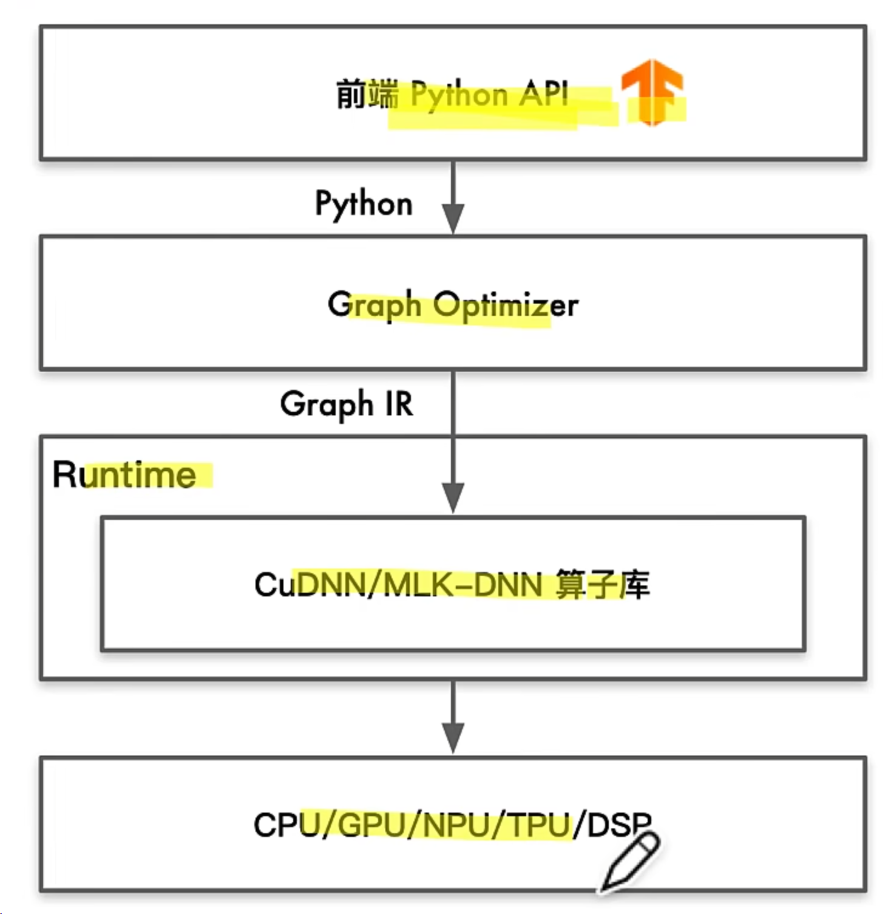
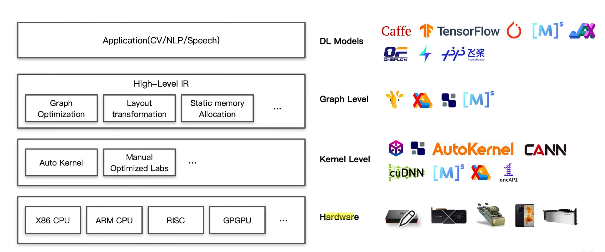

## AI Compiler

### Challenge

1. 越来越多新算子被提出，算子库的开发、维护、优化和测试工作量指数上升
   1. 增加新算子，硬件要实现，并且尽量充分发挥硬件性能。
   2. 硬件供应商还会有针对性发布优化库（MKL-DNN&CuDNN）。但是对于专用硬件，需要提供开发类似的优化库，不仅会增加大量算子优化、封装工作，还会过于依赖库无法有效利用专用硬件芯片能力。
2. 专用加速芯片爆发导致性能可移植性成为一种刚需
   1. 大多数NPU使用ASIC，在神经网络场景对计算、存储和数据搬运做了特殊的指令优化，使得对AI相关的计算会提升性能，如NVIDIA虽然作为GPGPU，但是DGX系列提供专用的Tensor code
   2. 不同厂商提供XPU的ISA千奇百怪，一般缺乏如GCC、LLVM等编译工具链，使得针对CPU和GPU已有的优化算子库和针对语言的Pass很难短期移植到NPU上。

AI编译器与传统编译器的区别

AI编译器是构建在传统编译器之上的。

主要区别：

+ IR差异：AI编译器的IR与传统编译器的IR所抽象出来的概念和意义并不相同
  + AI编译器一般会有high-level IR，用来抽象描述深度学习模型中的运算，如Convolution、Matmul等，甚至部分会有Transformer带有图的结构。
  + 传统编译器相对而言low-level IR，用于描述基本指令运算，如load、store等。
+ 优化策略：AI编译器面向AI领域，优化时引入更多领域特定知识。
  + AI编译器在high-level IR执行算子融合，传统编译器执行类似loop fusion时，往往更加保守。缺点是可能会导致调试执行信息跟踪难。
  + AI编译器可以降低计算精度，如int8、fp16、bf16等，因为深度学习对计算精度不那么敏感。但传统编译器一般不执行改变变量类型和精度等优化。

### 定义

+ 推理场景：输入AI框架训练出来的模型文件，输出能够在不同硬件高效执行的程序
+ 训练场景：输入高级语言表示的神经网络代码，输出能够在不同硬件高效执行的程序

