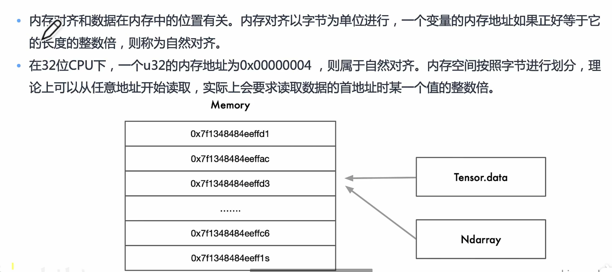
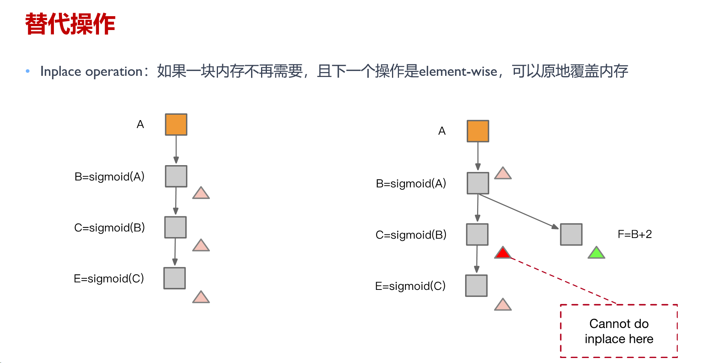
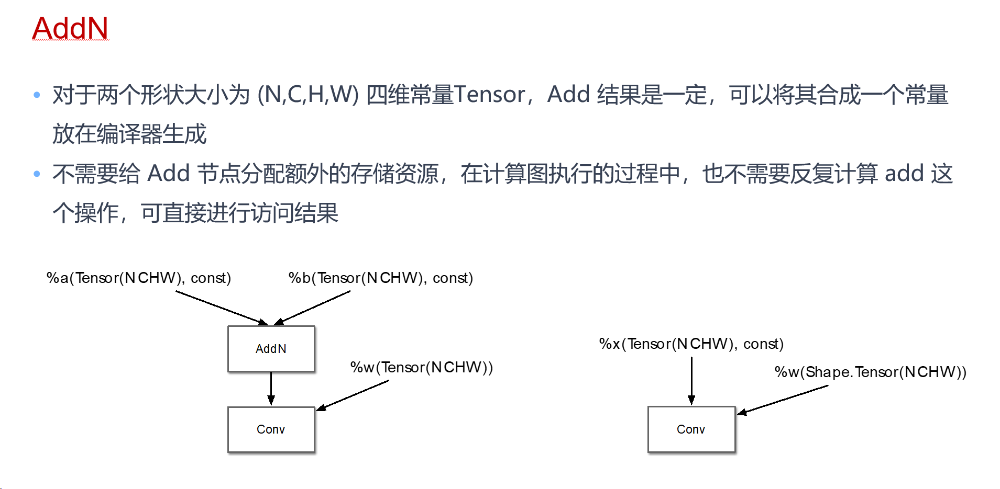

## AI编译器前端

优化方向：

+ 图层 Graph IR
+ 算子融合 OP Fusion
+ 布局转换 Layout Transform
+ 内存分配 Memory Allocation
+ 常量折叠 Constant Fold
+ 公共子表达式消除 CSE
+ 死代码消除 DCE
+ 代数简化 ARM

### 1.计算图

动态图转换为静态图的方式

+ 基于追踪转换：以动态图模式执行并记录调度的算子，构建和保存为静态图模型
+ 基于源码转换：分析前端代码将动态图代码自动转为静态图代码，底层使用静态图执行运行

**图优化**

TorchDynamo

### 2.算子融合

基于Graph IR，把一些小算子变成大算子。

#### 融合方式

纵向融合，减少一个kernel和一次中间结果缓存的开销

左侧B/C并行执行，但是对A有两次访存，右侧A+B/A+C并行，对A有一次访存

#### Conv-BN-ReLU算子融合例子

计算访存分析

#### TVM算子融合算法和策略

### 3.数据布局转换

#### 内存对齐

为什么要以字节大小粒度进行访存

#### 张量数据布局

#### NCHW与NHWC

C0与达芬奇架构强相关，等于AI Core中矩阵计算单元的大小，对于FP16类型为16，对于INT8类型则为32，这部分数据需要连续存储。其中C1=C/C0，如果结果不整除，向上取整。

#### AI编译器布局优化

### 4.内存分配

模型需求

模型训练时需要大量的显存空间：

+ InceptionV4设置batch size为32训练 ImageNet需要 40GB显存空间 ；

+ BERT拥有768个隐藏层，在Batch size设 置为64时需要73GB的显存空间  ；

+ 使用ImageNet训练Wide ResNet-152，并 设置Batch size为64需要显存180GB ；

#### 静态内存

+ Parameter - 网络中的权重

+ Value Node - 网络中的常量

+ Output - 网络的输出

比如一些固定的算子在整个计算图中都会使用，此时需要在模型初始化时一次性申请完内存空间，在实际推理时不需要频繁申请操作，提高性能。

#### 动态内存

+ Output Tensor - 网络中的算子的输出Tensor

+ Workspace Tensor - 网络中的部分算子在计算过程中的临时buffer

动态内存分配：对于中间临时的内存需求，可以进行临时申请和释放，节省内存使用，提高模型并发能力。

#### 内存优化算法

+ 空间换内存：如卸载到CPU (CPU Offload )
  + 把NPU/GPU的内存扔给CPU，CPU被当做虚存

+ 计算换内存： 重计算 (Gradient Checkpointing)
  + 重算一遍的效率更高，常用于大模型

+ 模型压缩：如量化训练 Quantification， 剪枝等压缩算法

+ **内存复用**：利用AI编译器对计算图中的数据流进行分析，以允许重用内存
  + 
  + 
  + 
  + 
  + 
  + 

### 5.常量折叠

直接从内存中加载常量表达式的结果

将常量进行替换

##### AI编译器中的常量折叠

AI编译器中如何实现常量折叠？

分类：

1.传统编译器中的常量折叠，找到输入节点均为常量的节点，提前计算出该节点的值来完整替换该节点。

2.常量折叠与数据形状 shape 有关系，通过计算图已有信息推断出形状结果后，用来代替原来的节点。

3.常量折叠与已知常量的代数化简有关。

### 6.公共子表达式消除

CSE（Common subexpression elimination），是一个编译器优化技术。在执行这项优化的过程中，编译器会视情况将多个相同的表达式替换成一个变量，这个变量存储着计算该表达式后所得到的值。

执行这项优化的可能性基于表达式的定义可达性。当以下条件成立，则一个表达式 b∗c 在程序的某个点 p 被定义为是可达的：

+ 从初始节点到点 p 的每条路径在到达 p 之前计算过 b∗c ；

+ b∗c 被计算后，无论 b 或者 c 到达 p 以前都没有被重新赋值过；

由编译器计算的成本效益分析可以判断出，重复计算该表达式的开销是否大于存储该表达式的计算结果，并且这个分析也要将寄存器等因素考虑在内。

编译器开发者将公共子表达式消除分成两种：

+ **本地公共子表达式消除**：这项优化技术工作于基本块之内。

+ **全局公共子表达式消除**：这项优化技术工作于整个过程之中。

#### AI编译器中CSE的使用

通过建立**候选哈希表 MAP**, 记录已处理过的同一种类型的 OP。对于当前正在处理的 OP，先查找该 MAP 表，如果能找到其他和正在处理的 OP 类型相同的 OP，则对其进行遍历，如果其中某个 OP 的输入和参数与当前正在处理的 OP 相同，则它们为公共子表达式，结果可以互相替代；如果所有 OP 都不能与当前正在处理的 OP 匹配，则将当前 OP 复制一份回。

### 7.死代码消除

编译器原理中，死码消除（Dead code elimination）是一种编译优化技术，它的用途是移除对程序执行结果没有任何影响的代码。移除这类的代码有两种优点，不但可以减少程序的大小，还可以避免程序在执行中进行不相关的运算行为，减少它执行的时间。

Pros：

+ 避免执行不必要的操作，提高了运行的效率,减少了运行时间。

+ 节省不必要的资源分配,优化空间。

+ 减少代码的长度，增加可读性。

##### AI编译器中的DCE

+ 死代码消除可以优化计算图的计算和存储效率，避免为死节点（无用节点）分配存储和进行计算，同时简化了计算图的结构，方便进行后续的其他图优化Pass。

+ 死代码消除一般不是在定义神经网络模型结构时候引起的，而是其他图优化 Pass 造成的结果，因此死代码消除 Pass 常常在其他图优化 Pass 后被应用。

推理时执行DCE，可以把训练中用到，但是推理中用不到的子图删掉

### 8.代数化简原理

代数化简的目的是利用交换率、结合律等规律调整图中算子的执行顺序，或者删除不必要的算子，以提高图整体的计算效率。

代数化简可以通过子图替换的方式完成，具体实现：

+ 可以先抽象出一套通用的子图替换框架，再对各规则实例化。

+ 可以针对每一个具体的规则实现专门的优化逻辑。

运行化简：减少运算或者执行时候，冗余的算子或者算子对。

广播化简：多个张量形状 Shape 不同，需要进行广播将张量的形状拓展为相同 shape 再进行运算，化简为最小计算所需的广播运算数量。

### 9.前端优化Pass的顺序

