## AI编译器后端优化

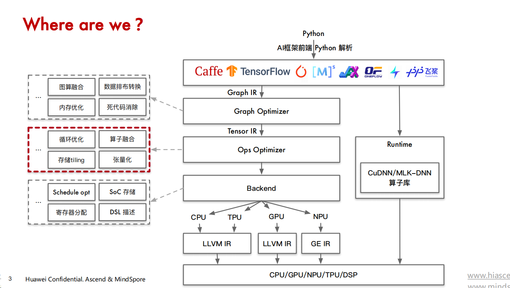

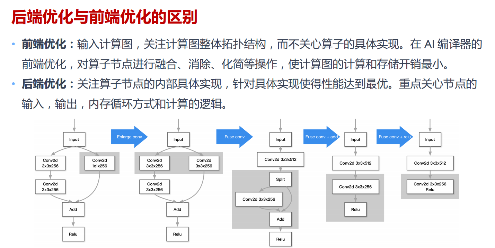

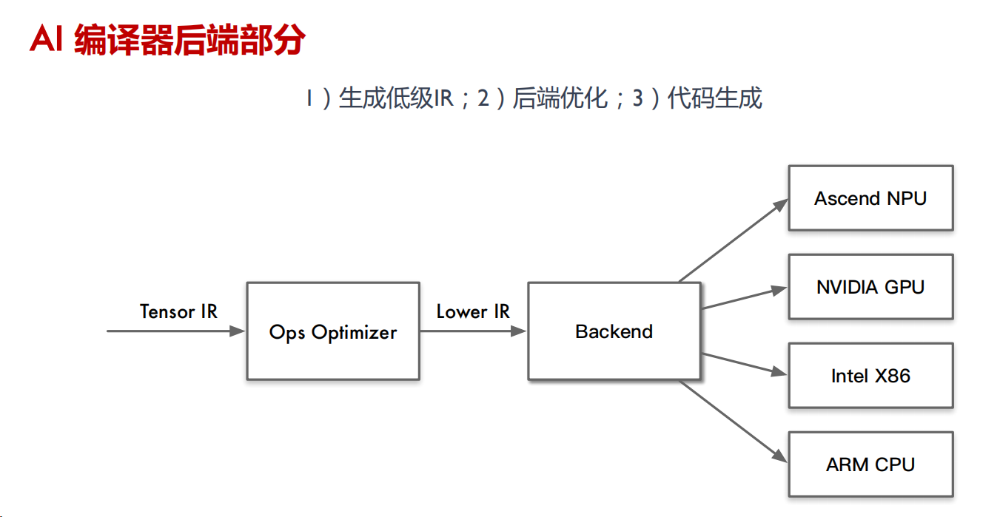

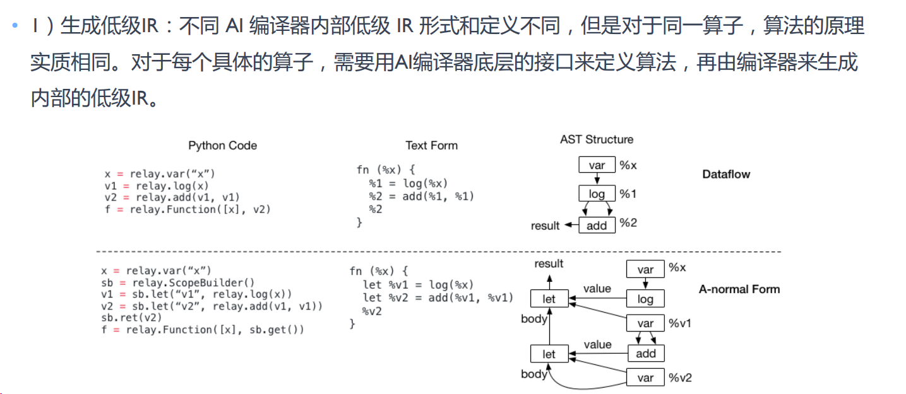

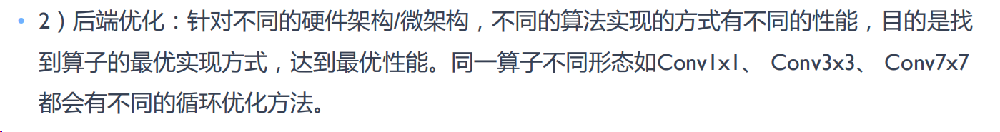

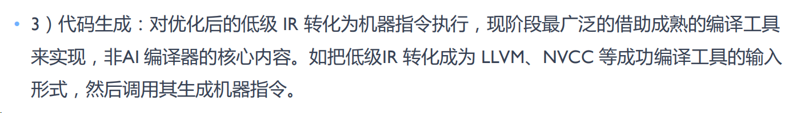

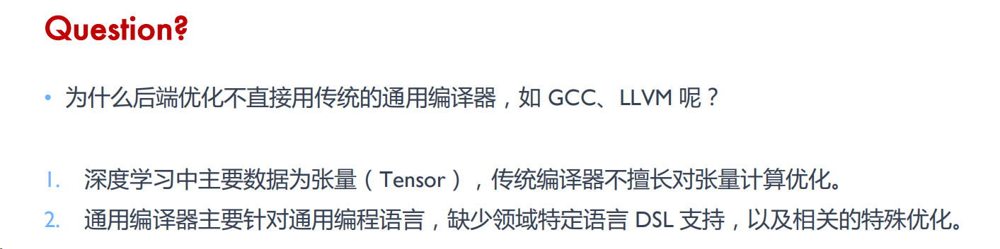

**算子分类：**

+ **访存密集型**：

  + 如 RNN 训练任务，由于 RNN 网络模型结构的计算密度更低，瓶颈转移到host端的 Op Launch 上，因此kernel之间甚至出现了大量空白。对于访存密集型算子部分的工作来说，新硬件带来了更大的性能优化空间。

+ **计算密集型**：

  + 计算密度是指一个程序在单位访存量下所需的计算量，单位是 FLOPs/Byte，计算

    密度较大，程序性能受硬件最大计算峰值（下文简称为算力）限制，称为计算密集型程序

**算子优化的挑战**：

+ **优化手段多样**：要在不同情况下权衡优化及其对应参数，对于优化专家来说也是相当耗费精力

+ **通用性与移植性**：不同类型的硬件架构差异，使得优化方法要考虑的因素也有很大不同

+ **优化间相互影响**：各种优化之间可能会相互制约，相互影响。这意味着找到最优的优化方法组合与序列就是一个困难的组合优化问题，甚至是 NP 问题。

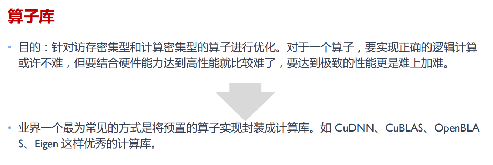

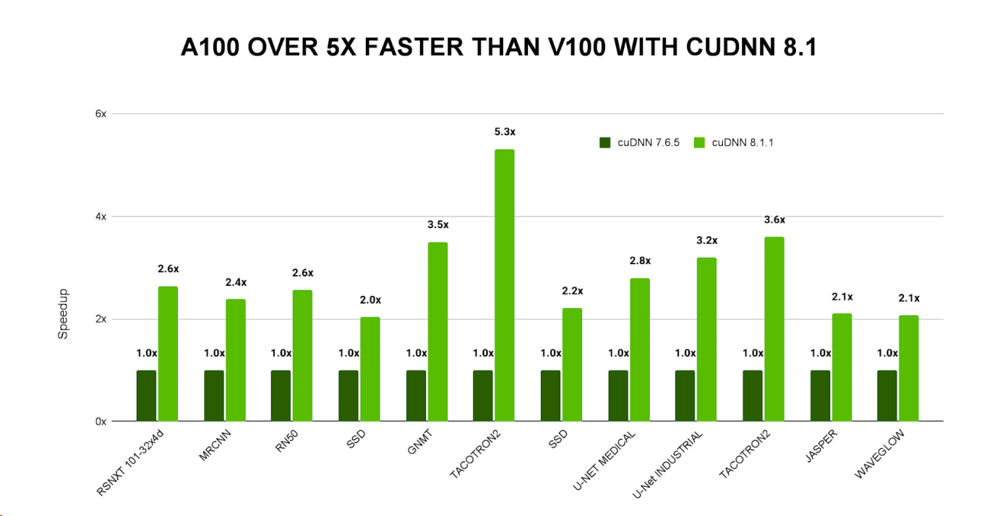

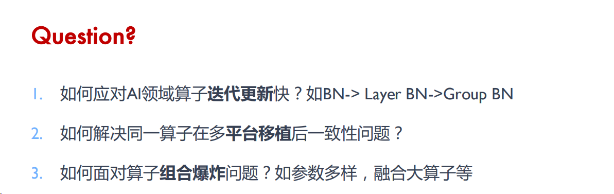

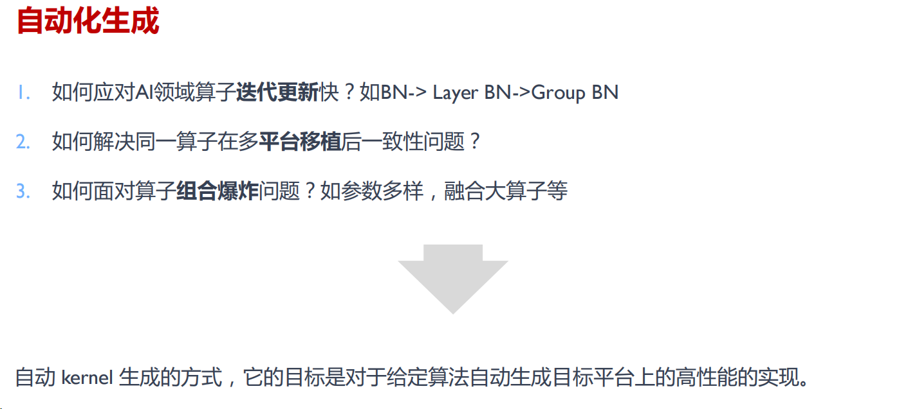

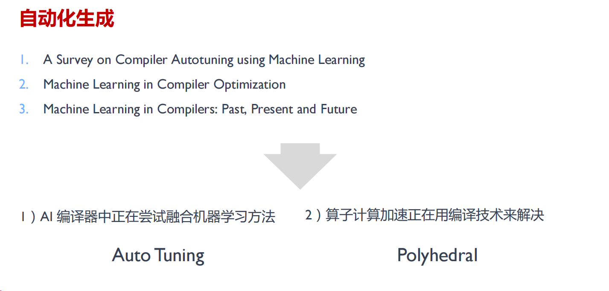

### 1.算子计算与调度

