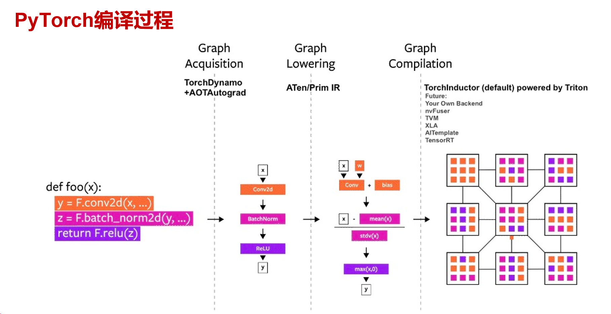
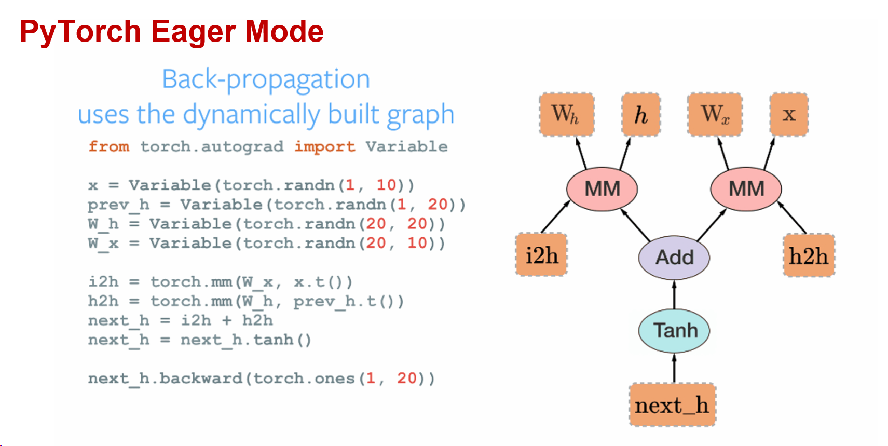
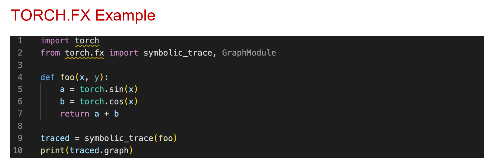
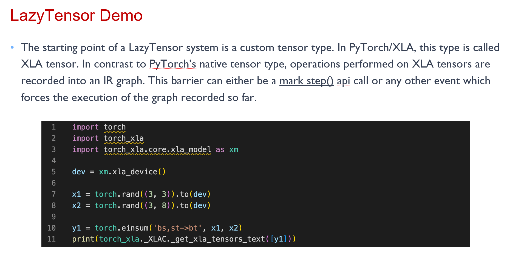
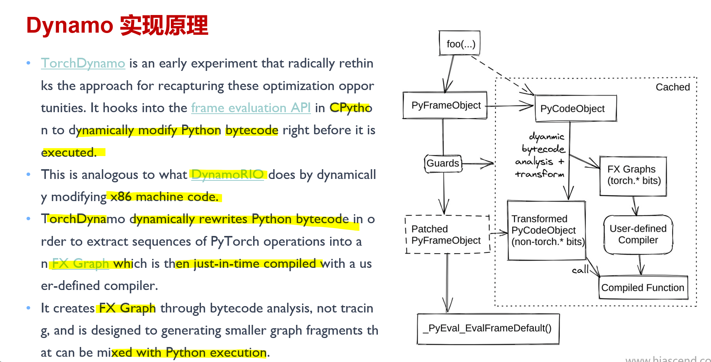

## PyTorch2.0

### 1.PyTorch2.0新特性

+ TorchDynamo
+ AOTAutograd
+ TorchInductor
+ PrimTorch

### 2.TorchScript

PyTorch最初只有动态图模式

但是无图，无编译。

PyTorch1.3进行过TorchScript的尝试。

获取静态计算图有两种方式：

+ **基于追踪Trace**：直接执行用户代码，记录下算子调用序列，将算子调用序列保存为静态图，执行中脱离前端语言环境，由运行时按照静态图逻辑执行；PyTorch FX

  

  优点是能够更广泛地支持宿主语言中的各种动态控制流语句；

  缺点是执行场景受限，只能保留程序有限执行轨迹并线性化，静态图失去源程序完整控制结构；

+ **基于源代码解析：**以宿主语言的抽象语法树（AST）为输入，转化为内部语法树，经过别名分析，SSA（static single value assignment），类型推断等Pass，转换为计算图表示；PyTorch JIT

  

  优点是能够更广泛地支持宿主语言中的各种动态控制流语句；

  缺点是后端实现和硬件实现会对静态图表示进行限制和约束，多硬件需要切分多后端执行逻辑；宿主语言的控制流语句并不总是能成功映射到后端运行时系统的静态图表示；遇到过度灵活的动态控制流语句，运行时会退回到由前端语言跨语言调用驱动后端执行；

TorchScript 是 Python 的静态类型子集，可以通过 @torch.jit.script 装饰器进行Python源码解析或者通过基于跟踪（tracing base）从python代码自动生成。

TorchScript 从 PyTorch 代码**创建可序列化和可优化模型**的方法。任何 TorchScript 程序都可以从 Python 进程中保存，并加载到没有 Python 依赖的进程中。

TorchScript：

pros：

+ 能把动态图转为静态图，对静态图进行编译优化和执行
+ 作为PyTorch关于静态图的第一次尝试

cons：

+ 静态图只能表达正向图，不能够处理反向图和动态shape，使用场景有限
+ 静态图IR复杂、难学，对于想修改或者增加优化Pass的开发者来说成本高

### 3.TorchFX

torch.fx represents programs in a DAG-based IR, which contains a linear series of Node objects representing operations. Nodes have a string opcode, describing what type of operation the Node represents. Nodes have an associated target, which is the call target for call nodes (call_module, call_function, and call_method).

**Pros**

+ 能够对正向计算图进行操作，如批量增加、修改某个操作，增加统计操作，如量化；

+ 是一个Python-to-Python的符号Trace方式，方便学习和进行源码操作，TorchScript需要C++处理；

+ IR 表示缩减到 6 个操作，操作简单和 IR 易学；

**Cons**

+ 静态图只能表达正向图，不能够处理反向图和表示带有控制流的图，使用场景有限；

+ Python-to-Python的Trace操作，继承了Trace Base转静态图的缺点；

+ 需要用户感知替换，只能处理量化、融合算子等有限情况；

### 4.LazyTensor

Any operation performed on a PyTorch tensor is by default dispatched as a kernel or a composition of kernels to the underlying hardware. These kernels are executed asynchronously on the underlying hardware. The program execution is not blocked until the value of a tensor is fetched. This approach scales extremely well with massively parallel programmed hardware such as GPUs.

LazyTensor Principle

XLA Tensor-->IR graph 子图

一次下发一个子图到硬件上，而不是一个算子

**Pros**：

+ LazyTensor在一定程度上能够带来优化收益

+ 语法限制少，理论上只要找到合适的tensor操作序列都可以进行编译成子图

**Cons**：

+ JIT 编译开销大，遇到特殊网络模型会来回重复异步调度（host-devices）。

+ 动态情况下，如动态 shape 和控制流，每次变化都会触发新的编译，导致性能退化严重。

+ 因为 fusion kernel 执行的原子特性，破坏了操作之间并行执行的可能性

+ 影响 PyTorch eager mode 下 kernel 下发和执行可以重叠的异步计算，部分情况会增加执行开销

  

### 5.TorchDynamo

Python执行机制：

**CPython**： CPython 混合了编译和解释功能，将Python源代码首先被编译成一系列中间字节码，然后由CPython虚拟机内部 while 循环不断匹配字节码并执行对应字节码指令 case 分支内部的多条C函数。

### 6.AOTAutograd

+ TorchDynamo hooks into the frame evaluation API in CPython to dynamically modify Python bytecode right before it is executed. 

+ It rewrites Python bytecode in order to extract sequences of PyTorch operations into an [FX Graph](https://pytorch.org/docs/stable/fx.html) which is then just-in-time compiled with an ensemble of different backends and autotuning.

+ Training adds challenges because the PyTorch Automatic Differentiation engine sits below the PyTorch dispatcher in C++. Therefore, the operators running in the backward pass are not directly visible to **TorchDynamo at the Python level**.

  反向图是C++层面的，为了解决这个问题，PyTorch提出了AOTAutograd。

+ To support training with TorchDynamo, we need to run/optimize operations that happen in the .backward() pass. Supporting backwards can be done in a few different ways:
  + **Eagerly**: backends could use the dynamic autograd tape on every call, the same as eager mode.
  + **TorchScript**:  Difficult to maintain and does not support all operations.
  + **AOTAutograd**: Records the behavior of the eager dispatcher-based autograd once at compile time. This allows it to capture everything with a simpler and more robust implementation that reuses much more of eager mode autograd. In addition, it allows us to easily make optimization decisions with visibility of both the forwards and backwards graphs.

+ AOTAutograd relies on the recently introduced **torch_dispatch** based tracing mechanism to capture the backward graph ahead of time. Therefore, it reuses the PyTorch core Autograd engine to generate the backward graph. 

### 7.dispatch

需要一个 Dispatcher，让它来统一管理分派工作

1.https://pytorch.org/tutorials/advanced/dispatcher.html

2.https://pytorch.org/tutorials/advanced/extend_dispatcher.html

3.http://blog.ezyang.com/2020/09/lets-talk-about-the-pytorch-dispatcher/

4.https://developer.aliyun.com/article/911380

5.https://dev-discuss.pytorch.org/t/what-and-why-is-torch-dispatch/557

6.https://dev-discuss.pytorch.org/t/tracing-with-primitives-update-0/577

7.https://zhuanlan.zhihu.com/p/376495783

8.https://zhuanlan.zhihu.com/p/386876377

9.https://blog.csdn.net/Chris_zhangrx/article/details/119489853

10.https://www.cnblogs.com/ijpq/p/16292722.html