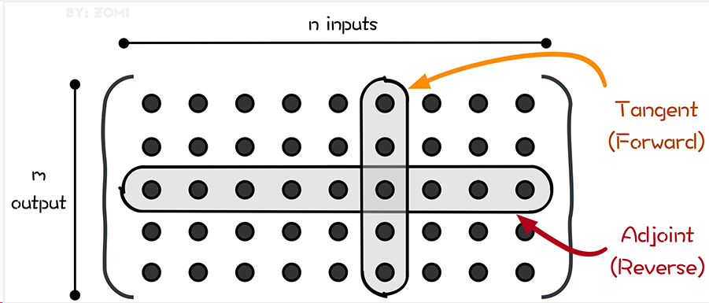
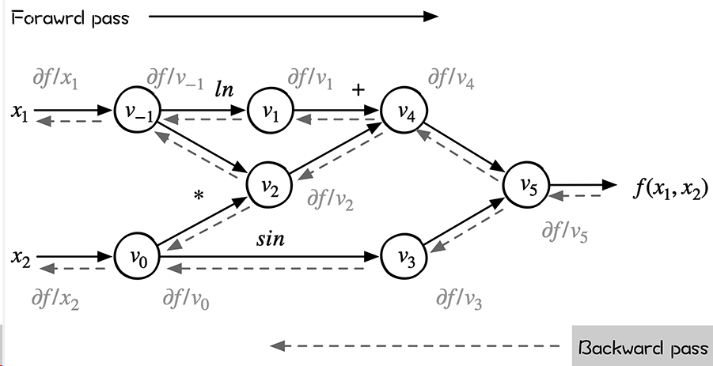
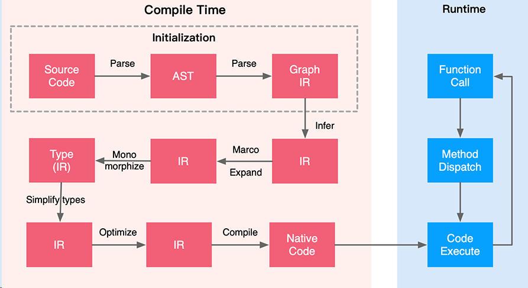
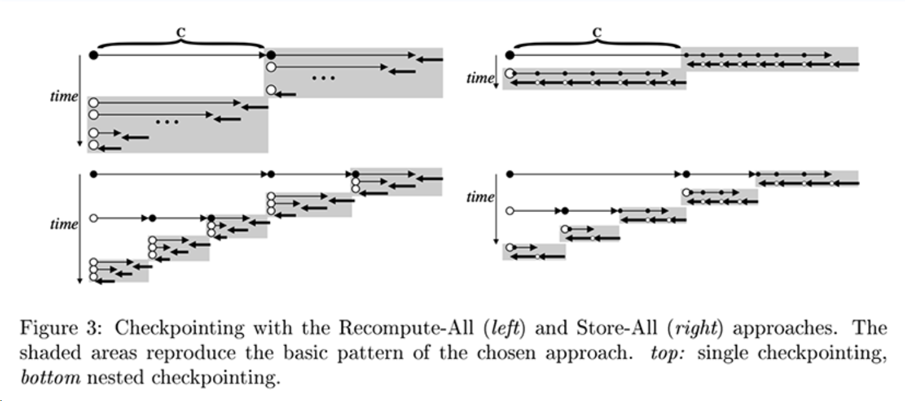

## 自动微分 Autodiff

- 了解AI框架实现中最重要的自动微分原理
- 知道业界主流的AI框架的具体实现方式
- 自动微分的技术未来发展动向与面临的挑战

### 1.微分方式

#### 1.1数值微分

+ 数值微分中常用的三种计算方式及其对应的截断误差可以归纳为三种。

  - 向前差商（Forward Difference）：

  $$\frac{\delta f(x)}{\delta x} \approx \frac{f(x+h)-f(x)}{h} $$
  其中Forward Difference的阶段误差为 $O(h)$。

  - 向后差商（Reverse Difference）：

  $$ \frac{\delta f(x)}{\delta x} \approx \frac{f(x)-f(x-h)}{h} $$
  其中Reverse Difference的阶段误差为 $O(h)$。

  - 中心差商（Center Difference）

  $$ \frac{\delta f(x)}{\delta x} \approx \frac{f(x+h)-f(x-h)}{2h} $$
  数值微分中的截断误差与步长 $h$ 有关，$h$ 越小则截断误差越小，近似程度越高。但实际情况数值微分的精确度并不会随着 $h$ 的减小而无限减小，因为计算机系统中对于浮点数的运算由于其表达方式存在另外一种误差（舍入误差，Round-off Error），而舍入误差则会随着 $h$ 变小而逐渐增大。因此在截断误差和舍入误差的共同作用下，数值微分的精度将会形成一个变化的函数并在某一个 $h$ 值处达到最小值。

+ 数值微分的优点是：

  - 具有计算适用性，对大部分表达式适用；
  - 对用于显示地隐藏了求导过程；
  - 简单容易实现。

  数值微分的缺点是：

  - 计算量大，求解速度最慢，因为每计算一个参数的导数，都需要重新计算。
  - 引入误差，因为是数值逼近，所有会不可靠，不稳定的情况，无法获得一个相对准确的导数值。如果 $h$ 选取不当，可能会得到与符号相反的结果，导致误差增大。
  - 引入截断错误（Truncation error），在数值计算中 h 无法真正取零导致的近似误差。
  - 引入舍入误差（Round-off Error），在计算过程中出现的对小数位数的不断舍入会导致求导过程中的误差不断累积。

#### 1.2符号微分

符号微分（Symbolic Differentiation）属符号计算的范畴，利用链式求导规则对表达式进行自动计算，其计算结果是导函数的表达式。符号计算用于求解数学中的公式解，得到的是解的表达式而非具体的数值。

符号微分的优点是：

- 简单容易实现；
- 精度高，可适用于更复杂的数学问题求解等场景。

符号微分的缺点是：

- 表达式复杂时候，求导结果存在表达式膨胀问题；
- 表达式必须是闭包（closed form）形式，即必须能写成完整数学表达式，不能有编程语言中的循环结构、条件结构等，才能将整个问题转换为一个纯数学符号问题。

#### 1.3自动微分

自动微分是介于数值微分和符号微分之间的方法，采用类似有向图的计算来求解微分值。

- 数值微分：直接代入数值近似求解；
- 符号微分：对代数表达式求解析解，再代入数值进行计算；
- 自动微分：对基本算子（函数）应用符号微分方法，其次代入数值进行计算，保留中间结果，最后通过链式求导法将中间结果应用于整个函数。这样可以做到完全向用户隐藏微分求解过程，也可以灵活于编程语言的循环结构、条件结构等结合起来。

自动微分的精髓在于它发现了微分计算的本质：微分计算就是一系列有限的可微算子的组合。自动微分法被认为是对计算机程序进行非标准的解释。自动微分基于一个事实，即每一个计算机程序，不论它有多么复杂，都是在执行加减乘除这一系列基本算数运算，以及指数、对数、三角函数这类初等函数运算。

以如下为例，这是原始公式：

$$ y=f(g(ℎ(x)))=f(g(ℎ(w_0)))=f(g(w_1))=f(w_2)=w_3$$

自动微分以链式法则为基础，把公式中一些部分整理出来成为一些新变量，然后用这些新变量整体替换这个公式，于是得到：

$$ w_0=x \\ w_1=h(w_0) \\ w_2=g(w_1) \\ w_3=f(w_2)=y $$
然后把这些新变量作为节点，依据运算逻辑把公式整理出一张有向无环图（DAG）。即原始函数建立计算图，数据正向传播，计算出中间节点，并记录计算图中的节点依赖关系。

因此，自动微分可以被认为是将一个复杂的数学运算过程分解为一系列简单的基本运算， 其中每一项基本运算都可以通过查表得出来。

因此自动微分的优缺点可以简单总结如下：

- 优点：精度高，无表达式膨胀问题；

- 缺点：需要存储一些中间求导结果，内存占用会增加。

[自动微分方法与最优化 ](https://book.sciencereading.cn/shop/book/Booksimple/show.do?id=B444C1CF681BF4EB0923507C23B8A91C8000)

### 2.自动微分的计算模式

#### 2.1Jacobian矩阵

在向量微积分中，Jacobian矩阵是一阶偏导数以一定方式排列成的矩阵，其行列式称为Jacobian行列式。Jacobian矩阵的重要性在于它体现了一个可微方程与给出点的最优线性逼近。

Jacobian 矩阵表示两个向量所有可能的偏导数。它是一个向量相对于另一个向量的梯度，其实现的是 $n$ 维向量到 $m$ 维向量的映射。

在矢量运算中，Jacobian 矩阵是基于函数对所有变量一阶偏导数的数值矩阵，当输入个数等于输出个数时又称为Jacobian行列式。

假设输入向量 $𝑥∈𝑅_𝑛$，而输出向量 $𝑦∈𝑅_𝑚$，则 Jacobian 矩阵定义为：

$$ J_f= \left[ \begin{matrix} \dfrac{\delta y_1}{\delta x_1} & \cdots & \dfrac{\delta y_1}{\delta x_n} \\ \vdots & \ddots & \vdots \\ \dfrac{\delta y_m}{\delta x_1} & \vdots & \dfrac{\delta y_m}{\delta x_n} \end{matrix} \right]$$

#### 2.2计算模式

根据对分解后的基本操作求导和链式规则组合顺序的不同，自动微分可以分为两种模式：

- *前向模式*（Forward Automatic Differentiation，也叫做 tangent mode AD）或者前向累积梯度（前向模式）
- *反向模式*（Reverse Automatic Differentiation，也叫做 adjoint mode AD）或者说反向累计梯度（反向模式）。

两种自动微分模式都通过递归方式来求 $dy/dx$，只不过根据链式法则展开的形式不太一样。

前向梯度累积会指定从内到外的链式法则遍历路径，即先计算 $dw_1/dx$，再计算 $dw_2/dw_1$，最后计算 $dy/dw_2$。即，前向模式是在计算图前向传播的同时计算微分。因此前向模式的一次正向传播就可以计算出输出值和导数值。

$$ \frac{dw_i}{dx}=\frac{dw_i}{dw_{i-1}}\frac{dw_{i-1}}{dx} $$

反向梯度累积正好相反，它会先计算 $dy/dw_2$，然后计算 $dw_2/dw_1$，最后计算 $dw_1/dx$。这是最为熟悉的反向传播模式，它非常符合**沿模型误差反向传播**这一直观思路。

即，反向模式需要对计算图进行一次正向计算， 得出输出值，再进行反向传播。反向模式需要保存正向传播的中间变量值（比如$𝑤_𝑖$），这些中间变量数值在反向传播时候被用来计算导数，所以反向模式的内存开销要大。

$$ \frac{dy}{dw_i}=\frac{dy}{dw_{i+1}}\frac{dw_{i+1}}{dw_i} $$

即如图所示，前向自动微分（tangent mode AD）和后向自动微分（adjoint mode AD）分别计算了Jacobian矩阵的一列和一行。



#### 2.3前向模式

##### 雅克比-向量矩阵

把上述过程当做雅克比矩阵求解问题，假设一个函数有 n 个输入变量 $x_i$，m个输入变量 $y_j$，即输入向量 $x \in R^n, y \in R^m$，则这个的映射是：

$$ f:R^n \to R^m $$

在这种情况下，每个自动微分的前向传播计算时候，初始输入被设置为 $\dot{x_i}=1$，其余被设置为 0。对应Jacobian矩阵定义为：

$$ J_f= \left[ \begin{matrix} \dfrac{\delta y_1}{\delta x_1} & \cdots & \dfrac{\delta y_1}{\delta x_n} \\ \vdots & \ddots & \vdots \\ \dfrac{\delta y_m}{\delta x_1} & \vdots & \dfrac{\delta y_m}{\delta x_n} \end{matrix} \right] $$

一次前向计算，可以求出Jacobian矩阵的一列数据，如 $\dot{x_3}=1$ 对应就可以求出来第3列。tangent mode AD可以在一次程序计算中，通过链式法则递推得到Jacobian矩阵中与单个输入有关的部分，即Jacobian矩阵的一列。

如果想用正向模式求对所有输入的导数，需要计算 n 次才能求出所有列。

进一步，设置 $\dot{x}=r$，可以在一次前向传播中直接计算 Jacobian–vector 乘积：

$$J_f \cdot r= \left[ \begin{matrix} \dfrac{\delta y_1}{\delta x_1} & \cdots & \dfrac{\delta y_1}{\delta x_n} \\ \vdots & \ddots & \vdots \\ \dfrac{\delta y_m}{\delta x_1} & \vdots & \dfrac{\delta y_m}{\delta x_n} \end{matrix} \right] \left[ \begin{matrix} r_1 \\ \vdots \\ r_n \\ \end{matrix} \right] $$

最终我们可以递归的得到本次迭代的计算目标：雅克比矩阵中的第 i 行。


对于函数 $\overline{y}=f(\overline{x})$，其中 $f: \mathbb{R}^{n} \rightarrow \mathbb{R}^{m}$，那么 $\overline{y}$ 中关于 $\overline{x}$ 的梯度可以表示为 Jacobian 矩阵：

$$ J_{f}= \left[\begin{array}{ccc} \dfrac{\partial y}{\partial x_{1}} & \cdots & \dfrac{\partial y}{\partial x_{1}} \end{array}\right]= \left[\begin{array}{ccc} \dfrac{\partial y_{1}}{\partial x_{1}} & \cdots & \dfrac{\partial y_{1}}{\partial x_{n}} \\ \vdots & \ddots & \vdots \\ \dfrac{\partial y_{m}}{\partial x_{1}} & \cdots & \dfrac{\partial y_{m}}{\partial x_{n}} \end{array}\right] $$

设置 $\overline{v}$ 是关于函数 $l=g(\overline{y})$ 的梯度：

$$ \overline{v}= \left[\begin{array}{lll} \dfrac{\partial l}{\partial y_{1}} & \cdots & \dfrac{\partial l}{\partial y_{m}} \end{array}\right]^{\mathrm{T}} $$

Jacobian-vector 积就是函数 $l$ 中关于 $x_1$ 的梯度：

$$ \boldsymbol{J} \cdot \overline{v}= \left[\begin{array}{ccc} \dfrac{\partial y_{1}}{\partial x_{1}} & \cdots & \dfrac{\partial y_{1}}{\partial x_{n}} \\ \vdots & \ddots & \vdots \\ \dfrac{\partial y_{m}}{\partial x_{1}} & \cdots & \dfrac{\partial y_{m}}{\partial x_{n}} \end{array}\right] \cdot\left[\begin{array}{c} \dfrac{\partial l}{\partial y_{1}} \\ \vdots \\ \dfrac{\partial l}{\partial y_{m}} \end{array}\right]=\left[\begin{array}{c} \dfrac{\partial y_{1}}{\partial x_{1}} \\ \vdots \\ \dfrac{\partial y_{m}}{\partial x_{1}} \end{array}\right] $$

即通过雅克比矩阵转置与后续节点梯度值的乘积，可以得到当前节点的梯度值。

前向模式在计算之中，计算图各个节点的数值和该节点的导数可同步求出，但是代价就是对于多个输入需要多次计算才行。


前向模式的优点：

- 实现起来很简单
- 也不需要很多额外的内存空间

前向模式的缺点：

- 每次前向计算只能计算对一个自变量的偏导数，对于一元函数求导是高效的，但是机器学习模型的自参数（入参）数量级大。
- 如果有一个函数，其输入有 n 个，输出有 m个，对于每个输入来说，前向模式都需要遍历计算过程以得到当前输入的导数，求解整个函数梯度需要 n 遍如上计算过程。

前向模式适合n<m的情况。

#### 2.4反向模式

反向自动微分同样是基于链式法则。仅需要一个前向过程和反向过程，就可以计算所有参数的导数或者梯度。因为需要结合前向和后向两个过程，因此反向自动微分会使用一个特殊的数据结构，来存储计算过程。而这个特殊的数据结构例如Tensorflow或者MindSpore，是把所有的操作以一张图的方式存储下来，这张图可以是一个有向无环（DAG）的计算图；而Pytroch则是使用Tape来记录每一个操作，他们都表达了函数和变量的关系。

反向模式根据从后向前计算，依次得到对每个中间变量节点的偏导数，直到到达自变量节点处，这样就得到了每个输入的偏导数。在每个节点处，根据该节点的后续节点（前向传播中的后续节点）计算其导数值。

整个过程对应于多元复合函数求导时从最外层逐步向内侧求导。这样可以有效地把各个节点的梯度计算解耦开，每次只需要关注计算图中当前节点的梯度计算。



##### 向量-雅可比矩阵

对于函数 $\overline{y}=f(\overline{x})$，其中 $f: \mathbb{R}^{n} \rightarrow \mathbb{R}^{m}$，那么 $\overline{y}$ 中关于 $\overline{x}$ 的梯度可以表示为 Jacobian 矩阵：

$$ J_{f}= \left[\begin{array}{ccc} \dfrac{\partial y}{\partial x_{1}} & \cdots & \dfrac{\partial y}{\partial x_{1}} \end{array}\right]= \left[\begin{array}{ccc} \dfrac{\partial y_{1}}{\partial x_{1}} & \cdots & \dfrac{\partial y_{1}}{\partial x_{n}} \\ \vdots & \ddots & \vdots \\ \dfrac{\partial y_{m}}{\partial x_{1}} & \cdots & \dfrac{\partial y_{m}}{\partial x_{n}} \end{array}\right] $$

设置 $\overline{v}$ 是关于函数 $l=g(\overline{y})$ 的梯度：

$$ \overline{v}= \left[\begin{array}{lll} \dfrac{\partial l}{\partial y_{1}} & \cdots & \dfrac{\partial l}{\partial y_{m}} \end{array}\right]^{\mathrm{T}} $$

vector-Jacobian积就是函数 $l$ 中关于 $\overline{x}$的梯度：
$$
\boldsymbol{J}^{T} \cdot \overline{v}
$$
$$
\mathbf{v}^{T} \cdot J = \begin{bmatrix}
\frac{\partial l}{\partial y_1} \cdots \frac{\partial l}{\partial y_m}
\end{bmatrix} \begin{bmatrix}
\frac{\partial y_1}{\partial x_1} \quad \cdots \quad \frac{\partial y_1}{\partial x_n} \\
\vdots \quad \ddots \quad \vdots \\
\frac{\partial y_m}{\partial x_1} \quad \cdots \quad \frac{\partial y_m}{\partial x_n}
\end{bmatrix} = \begin{bmatrix}
\frac{\partial l}{\partial x_1} \cdots \frac{\partial l}{\partial x_n}
\end{bmatrix}
$$

反向传播过程中如果直接存储雅克比矩阵，会消耗大量存储空间。取而代之，如果只存储向量-雅克比的乘积，在减少存储的同时并不会阻碍导数的计算。因此，AI 框架在实现自动微分时，对每个中间层存储的都是向量-雅克比的乘积，而非雅克比矩阵。

在实际的 AI 框架构建的计算图中，并不是把正向节点和反向节点融合在一张图，而是构建起一张大图包括正向和反向，或者是构建起两张图，一张正向的计算图，一张反向的计算图，通过输出节点把正反向计算图链接在一起。


反向模式的优点：

- 通过一次反向传输，就计算出所有偏导数，中间的偏导数计算只需计算一次

- 减少了重复计算的工作量，在多参数的时候后向自动微分的时间复杂度更低

反向模式的缺点：

- 需要额外的数据结构记录正向过程的计算操作，用于反向使用

- 带来了大量内存占用，为了减少内存操作，需要深度学习框架进行各种优化，也带来了额外限制和副作用

#### 2.5二者的比较

前向自动微分（tangent mode AD和后向自动微分（adjoint mode AD）分别计算了Jacobian矩阵的一列和一行。前向模式和反向模式的不同之处在于矩阵相乘的起始之处不同。当输出维度小于输入维度，反向模式的乘法次数要小于前向模式。因此，当输出的维度大于输入的时候，适宜使用前向模式微分；当输出维度远远小于输入的时候，适宜使用反向模式微分。即，后向自动微分更加适合多参数的情况，多参数的时候后向自动微分的时间复杂度更低，只需要一遍reverse mode的计算过程，便可以求出输出对于各个输入的导数，从而轻松求取梯度用于后续优化更新。

因此，目前大部分AI框架都会优先采用反向模式，但是也有例如MindSpore等AI框架同时支持正反向的实现模式。

#### 2.6计算实例

$$
f(x1,x2)=ln(x1)+x1x2−sin(x2)
$$

##### 前向模式

1. 我们给输入节点赋值，$v_{−1}=x_1=2，v_0=x_2=5$
2. 计算 $v_1$ 节点，$v_1=lnv_{−1}=lnx_1=ln2$
3. 计算 $v_2$ 节点，节点 $v_2$ 依赖于 $v_{-1}$ 和 $v_0$，$v_2=10$
4. 计算 $v_3$ 节点，$v_3=sinv_0=sin5$
5. 计算 $v_4$ 节点，$v_4=v_1+v_2=0.693+10$
6. 计算 $v_5$ 节点，$v_5=v_1+v_2=10.693+0.959$
7. 最终 $y=v_5=11.652$

此时，已经得到了图中所有节点的数值。自动微分正向模式中（上图右边Forward Tangent Trace），在计算节点数值的同时，也一起计算导数，假设求 $\delta y/ \delta x_1$，则是从输入开始计算。

1. 计算 $v_{-1}$ 节点对于 $x_1$ 的梯度：$v_{-1}=x_1$，所以 $\delta v_{-1}/ \delta x_1=1$
2. 计算 $v_0$ 节点对于 $x_1$ 的梯度：$v_0=x_2$，所以 $\delta v_0/ \delta x_1=0$
3. 计算 $v_{1}$ 节点对于 $x_1$ 的梯度：$\delta v_1/ \delta x_1=0.5$
4. 计算 $v_{2}$ 节点对于 $x_1$ 的梯度：$\delta v_{2}/ \delta x_1=(\delta v_{-1}/ \delta x_1)v_0+(\delta v_{0}/ \delta x_1)v_{-1}=5$
5. 计算 $v_{3}$ 节点对于 $x_1$ 的梯度：$\delta v_{3}/ \delta x_1=(\delta v_{0}/ \delta x_1)cosv_0=0$
6. 计算 $v_{4}$ 节点对于 $x_1$ 的梯度：$\delta v_{4}/ \delta x_1=\delta v_{1}/ \delta x_1+\delta v_{2}/ \delta x_1=0.5+5$
7. 计算 $v_{5}$ 节点对于 $x_1$ 的梯度：$\delta v_{5}/ \delta x_1=5.5=0$
8. 因此，得到 $\delta y/ \delta x_1=\delta v_{5}/ \delta x_1=5.5$

从计算过程来看啦，自动微分的前向模式实际上与我们在微积分里所学的求导过程一致。

##### 后向模式

1. 计算 $y$ 对 $v_5$ 的导数值，即 $\overline{v}_5=\overline{y}=1$
2. 计算 y 对 $v_4$ 的导数值，$\overline{v}_4=\overline{v}_5\frac{\delta{v_5}}{\delta{v_4}}=1$
3. 计算 y 对 $v_3$ 的导数值，$\overline{v}_3=\overline{v}_5\frac{\delta{v_5}}{\delta{v_3}}=-1$
4. 计算 y 对 $v_1$ 的导数值，$\overline{v}_1=\overline{v}_4\frac{\delta{v_4}}{\delta{v_1}}=1$
5. 计算 y 对 $v_2$ 的导数值，$\overline{v}_2=\overline{v}_4\frac{\delta{v_4}}{\delta{v_1}}=1$
6. 接下来要计算 y 对 $v_0$ 的导数值和 y 对 $v_{-1}$ 的导数值，因为 $v_0$ 和 $v_{-1}$ 都是后续有两个节点，因此需要分开计算。
7. 计算 $\frac{\delta{v_3}}{\delta{v_0}}=cosv_0=0.284$
8. 计算 $\frac{\delta{v_2}}{\delta{v_0}}=v_{-1}=2$
9. 计算 $\frac{\delta{v_2}}{\delta{v_{-1}}}=v_0=5$
10. 计算 $\frac{\delta{v_1}}{\delta{v_{-1}}}=\frac{1}{x_1}=0.5$

到目前为止，我们已经计算出来了所有步骤的偏导数的数值。现在需要计算 $\overline{v}_1$ 和 $\overline{v}_2$ 。计算 $\overline{v}_1$ 从最后的位置往前到自变量 $x_1$，有多条路径，需要将这个路径上的数值连乘起来得到一个乘积数值，然后将这多条路径的乘积数值相加起来得到最后的结果。

从 y 到 $x_1$ 的路径有两条，分别是：

1. $v_5 \to v_4 \to v_1 \to v_{-1}$，其数值乘积是 1∗1∗0.5=0.5
2. $v_5 \to v_4 \to v_2 \to v_{-1}$，其数值乘积是 1∗1∗ 5= 5

因此，$\overline{v}_1=0.5+5=5.5$，同理有 $\overline{v}_2=2.0-0.284=1.716$


### 3.自动微分的实现方式

Siskind 等学者在其综述论文Automatic Differentiation in Machine Learning: a Survey中对自动微分实现方案划分为三类：

**基本表达式**：基本表达式或者称元素库（Elemental Libraries），基于元素库中封装一系列基本的表达式（如：加减乘除等）及其对应的微分结果表达式，作为库函数。用户通过调用库函数构建需要被微分的程序。而封装后的库函数在运行时会记录所有的基本表达式和相应的组合关系，最后使用链式法则对上述基本表达式的微分结果进行组合完成自动微分。

基本表达式法的**优点**可以总结如下：

- 实现简单，基本可在任意语言中快速地实现为库

基本表达式法的**缺点**可以总结如下：

- 用户必须使用库函数进行编程，而无法使用语言原生的运算表达式；
- 另外实现逻辑和代码也会冗余较长，依赖于开发人员较强的数学背景

**操作符重载**：操作符重载或者称运算重载（Operator Overloading，OO），利用现代语言的多态特性（例如C++/JAVA/Python等高级语言），使用操作符重载对语言中基本运算表达式的微分规则进行封装。同样，重载后的操作符在运行时会记录所有的操作符和相应的组合关系，最后使用链式法则对上述基本表达式的微分结果进行组合完成自动微分。

操作符重载法的**优点**可以总结如下：

- 实现简单，只要求语言提供多态的特性能力
- 易用性高，重载操作符后跟使用原生语言的编程方式类似

操作符重载法的**缺点**可以总结如下：

- 需要显式的构造特殊数据结构和对特殊数据结构进行大量读写、遍历操作，这些额外数据结构和操作的引入不利于高阶微分的实现
- 对于一些类似 if，while 等控制流表达式，难以通过操作符重载进行微分规则定义。对于这些操作的处理会退化成基本表达式方法中特定函数封装的方式，难以使用语言原生的控制流表达式

**源代码变换**：源代码变换或者叫做源码转换（Source Code Transformation，SCT）则是通过对语言预处理器、编译器或解释器的扩展，将其中程序表达（如：源码、AST抽象语法树 或编译过程中的中间表达 IR）的基本表达式微分规则进行预定义，再对程序表达进行分析得到基本表达式的组合关系，最后使用链式法则对上述基本表达式的微分结果进行组合生成对应微分结果的新程序表达，完成自动微分。



从图中可以看到源码转换的整体流程分为编译时间和执行时间，以 MindSpore 为例，其在运行之前的第一个 epoch 会等待一段时间，是因为需要对源码进行编译转换解析等一系列的操作。然后再 run time 运行时则会比较顺畅，直接对数据和代码不断地按照计算机指令来高速执行。

编译阶段，在 Initialization 过程中会对源码进行 Parse 转换成为抽象语法树 AST，接着转换为基于图表示的中间表达 IR，这个基于图的IR从概念上理解可以理解为计算图，神经网络层数的表示通过图表示会比较直观。

接着对 Graph base IR进行一些初级的类型推导，特别是针对 Tensor/List/Str 等不同的基础数据表示，然后进行宏展开，还有语言单态化，最后再对变量或者自变量进行类型推导。可以从图中看到，很多地方出现了不同形式的 IR，IR 其实是编译器中常用的一个中间表达概念，在编译的 Pass 中会有很多处理流程，每一步处理流程产生一个 IR，交给下一个Pass进行处理。

最后通过 LLVM 或者其他等不同的底层编译器，最后把 IR 编译成机器码，然后就可以真正地在runtime执行起来。

源码转换法的**优点**可以总结如下：

- 支持更多的数据类型（原生和用户自定义的数据类型） + 原生语言操作（基本数学运算操作和控制流操作）
- 高阶微分中实现容易，不用每次使用 Tape 来记录高阶的微分中产生的大量变量，而是统一通过编译器进行额外变量优化和重计算等优化
- 进一步提升性能，没有产生额外的 tape 数据结构和 tape 读写操作，除了利于实现高阶微分以外，还能够对计算表达式进行统一的编译优化

源码转换法的**缺点**可以总结如下：

- 实现复杂，需要扩展语言的预处理器、编译器或解释器，深入计算机体系和底层编译
- 支持更多数据类型和操作，用户自由度虽然更高，但同时更容易写出不支持的代码导致错误
- 微分结果是以代码的形式存在，在执行计算的过程当中，特别是深度学习中大量使用for循环过程中间错误了，或者是数据处理流程中出现错误，并不利于深度调试

任何 AD 实现中的一个主要考虑因素是 AD 运算时候引入的性能开销。就计算复杂性而言，AD 需要保证算术量增加不超过一个小的常数因子。另一方面，如果不小心管理 AD 算法，可能会带来很大的开销。例如，简单的分配数据结构来保存对偶数（正向运算和反向求导），将涉及每个算术运算的内存访问和分配，这通常比现代计算机上的算术运算更昂贵。同样，使用运算符重载可能会引入伴随成本的方法分派，与原始函数的原始数值计算相比，这很容易导致一个数量级的减速。


### 4.自动微分的挑战与未来

虽然计算机实现自动微分已经发展了几十年，不过在自动微分的演进过程和未来发展，仍然遇到诸多挑战，这里主要总结两点：1）易用性；2）高效性能。针对这两点的改进，也是自动微分技术未来演进可以重点优化和改进的方向。

易用性将是挑战的首位，是因为自动微分的数学原理比较固定，相对其他更加复杂的凸优化、群和商群等的数学原理而言，自动微分自动微分本身的数学原理相对简单，但其实现的难点在于：

- 理想中的自动微分是对**数学表达**的分解、微分和组合过程

- 实际中的自动微分是对**程序表达**的分界、微分和组合过程

而**数学表达**和**程序表达**之间存在显著的差异。

在数学表达式的微分过程中，通常处理的是连续可微的实数类型数据。然而在程序表达中，现代高级编程语言（Python、C/C++、JAVA等）通常提供了多种丰富特性，用于开发者自定义组合数据类型，如 tuple、record、struct、class、dict 等。

特别地，在这些封装的组合数据类型中，除了常规意义中可微的计算机浮点数据类型（如 FP32、FP16、INT8 等），还可能包含一些用于描述数据属性的字段，如索引值、名称、数据格式等等，而这些字段也应该被排除在微分过程外。

如下所示，针对源码转换法的第一性原理 ANF 定义和 Python、C++ 都有其复杂的数学类型没有办法通过数学计算来表达。

```shell
<aexp> ::= NUMBER | STRING | VAR | BOOLEAN | PRIMOP

Python ::= [List, Enum, Tuple, Dict, DefaultDict]
C++ ::= [size_t, whcar_t, enum, struct , STL::list]
```

因此在实际的实现过程中，基本表达式法、操作符重载法一般只能通过预定义数据类型（如张量 Tensor 数据结构）来指定数据类型中哪些字段需要被微分，哪些不需要被微调，需要有更多的细节约束，开发者可定制的自由度较低。源码转换法则可以结合编译器或解释器的扩展来暴露一些接口给开发者，用于指定自定义数据类型的微分规则，但是灵活度太高实现起来不容易。

自动微分的计算需要使用原程序计算的中间结果。在前向模式中，由于微分过程和原程序计算过程是同步的，因此不会引入额外的存储代价。但在反向模式中，必须将先执行原程序计算过程并将中间结果进行保存，再用于反向自动微分过程中。

因此，如何选择需要存储的程序中间结果点（check-point）将在很大程度上决定自动微分在运行速度和内存占用两项关键性能指标上的平衡表现。



图中左侧的策略为，将尽量少的存储中间结果，而当需要的时候，则会使用更早的中间结果进行重计算来得到当前所需的中间结果。图中右侧的策略即为，将尽可能多的存储每一步中间结果，因此当需要时，可以直接获得而不需重计算。

显然，上述两种策略即为在牺牲运行时间和牺牲内存占用间取得平衡，具体应该选择哪种复用策略取决于具体场景的需求和硬件平台的限制。

在AI框架的特性中，上述中间变量的存储过程其实被称为**重计算**的过程，也是在大模型训练或者分布式训练的过程中经过会使用到，根据不同的选择复用策略又叫做**选择性重计算**。


可微编程是将自动微分技术与语言设计、编译器 / 解释器甚至 IDE 等工具链等深度融合，将微分作为高级编程语言中第一特性（first-class feature）。

而可微分编程是一种编程范型，在其中数值计算程序始终可通过自动微分来求导数。这允许了对程序中的参数的基于梯度优化（Gradient method），通常使用梯度下降或其他基于高阶微分信息的学习方法。可微分编程用于各个领域，尤其是科学计算和人工智能。

目前大多数可微编程框架，通过构建包含程序中的控制流和数据结构的图来工作。尝试通常分为两组：基于静态和编译图的方法，例如 TensorFlow、Theano、MXNet 和 PaddlePaddle。这些往往有助于良好的编译器优化和扩展到大型系统，但它们的静态特性使它们交互性较差，并且更易于编写程序类型（例如包含循环和递归的程序）。不仅有限，而且用户也难以推理、有效地解释他们的程序。

名为 Myia 的概念验证编译器工具链使用 Python 的一个子集作为前端，并支持高阶函数、递归和高阶导数。支持运算符重载、基于动态图的方法，例如 PyTorch、 AutoGrad 和 MindSpore。它们的动态性和交互性使大多数程序更易于编写和推理。但是，它们会导致解释器开销（尤其是在组合许多小操作时）、可扩展性降低以及编译器优化带来的好处减少。

先前方法的局限性在于它只能区分以适当语言编写的代码，AI 框架方法限制了与其他程序的互操作性。一种新可微编程的方法通过从语言的语法或 IR 构造图形来解决此问题，从而允许区分任意代码。