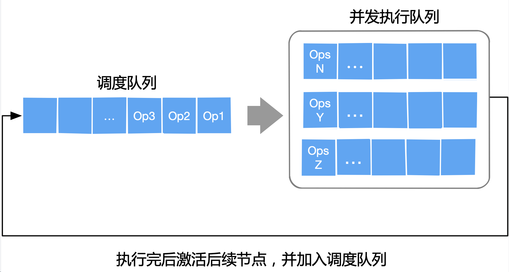
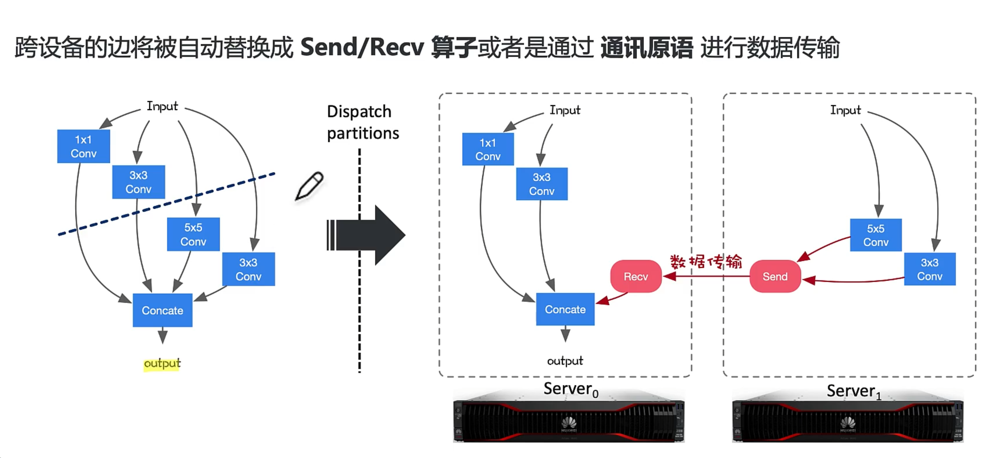

## 计算图

### 1.原理

目前主流的 AI 框架都选择使用**计算图**来抽象神经网络计算表达，通过通用的数据结构（张量）来理解、表达和执行神经网络模型，通过**计算图**可以把 AI 系统化的问题形象地表示出来。在 AI 框架中，计算图就是一个表示运算的有向无环图（Directed Acyclic Graph，DAG）。

在真正的 AI 工程化过程中，我们会遇到诸多问题。而为了高效地训练一个复杂神经网络，AI 框架需要解决许多问题，例如：

- 如何对复杂的神经网络模型实现自动微分？

- 如何利用编译期的分析 Pass 对神经网络的具体执行计算进行化简、合并、变换？

- 如何规划基本计算 Kernel 在计算加速硬件 GPU/TPU/NPU 上高效执行？

- 如何将基本处理单元派发（Dispatch）到特定的高效后端实现？

- 如何对通过神经网络的自动微分（反向传播实现）衍生的大量中间变量，进行内存预分配和管理？

为了使用统一的方式，解决上述提到的挑战，驱使着 AI 框架的开发者和架构师思考如何为各类神经网络模型的计算提供统一的描述，从而使得在运行神经网络计算之前，能够对整个计算过程尽可能进行推断，在编译期间自动为深度学习的应用程序补全反向计算、规划执行、降低运行时开销、复用和节省内存。能够更好地对特定领域语言（DSL），这里特指深度学习和神经网络进行表示，并对使用 Python 编写的神经网络模型进行优化与执行。

#### 1.1 张量

在执行计算任务中，数据常常被组织成一个高维数组，整个计算任务的绝大部分时间都消耗在高维数组上的数值计算操作上。高维数组和高维数组之上的数值计算是神经网络的核心，构成了计算图中最重要的一类基本算子。在 AI 框架的数据中主要有稠密张量和稀疏张量，这里先考虑最为常用的稠密张量。

张量作为高维数组，是对标量，向量，矩阵的推广。AI 框架对张量的表示主要有以下几个重要因素：

1. **元素数据类型**：在一个张量中，所有元素具有相同的数据类型，如整型，浮点型，布尔型，字符型等数据类型格式
2. **形状**：张量每个维度具有固定的大小，其形状是一个整型数的元组，描述了一个张量的维度以及每个维度的长度
3. **设备**：决定了张量的存储设备，如在通用处理器 CPU 中的 DDR 上还是 GPU/NPU 的 HBM 上等。

高维数组为开发者提供了一种逻辑上易于理解的方式来组织有着规则形状的同质数据，极大地提高了编程的可理解性。另一方面，使用高维数据组织数据，易于让后端自动推断并完成元素逻辑存储空间向物理存储空间的映射。更重要的是：张量操作将同构的基本运算类型作为一个整体进行批量操作，通常都隐含着很高的数据并行性，因此非常适合在单指令多数据（SIMD）并行后端上进行加速。

#### 1.2 计算图表示AI框架

计算图是用来描述运算的有向无环图，有两个主要元素：节点 (Node) 和边 (Edge)。节点表示数据，如向量、矩阵、张量；边表示具体执行的运算，如加、减、乘、除和卷积等。

在 AI 框架中会稍微有点不同，其计算图的基本组成有两个主要的元素：1）基本数据结构张量和2）基本计算单元算子。节点代表 Operator 具体的计算操作（即算子），边代表 Tensor 张量。整个计算图能够有效地表达神经网络模型的计算逻辑和状态。

- **基本数据结构张量**：张量通过 `shape` 来表示张量的具体形状，决定在内存中的元素大小和元素组成的具体形状；其元素类型决定了内存中每个元素所占用的字节数和实际的内存空间大小
- **基本运算单元算子**：具体在加速器 GPU/NPU 中执行运算的是由最基本的代数算子组成，另外还会根据深度学习结构组成复杂算子。每个算子接受的输入输出不同，如Conv算子接受3个输入Tensor，1个输出Tensor

使用了计算图，能够方便 AI 框架统一表示来描述神经网络训练的全过程。而动态计算图实际上只是一个虚拟概念，方便开发者和算法人员理解 AI
 框架中的执行过程，提升易用性。而使用静态计算图，其好处在于编译期可对计算过程的数据依赖进行分析：

- 简化数据流动的过程：通过计算图使用有向无环图的方式，避免无序的数据依赖

- 动态和静态内存优化：在神经网络模型执行中会产生固定和非固定的内存需求，基于计算图信息提前对内存进行优化

- 优化算子间的调度策略：方便进行算子的并行、算子的调度执行优化

- 改善运行时Runtime性能：通过计算图可以进行计算和通信的时间重叠优化

通过静态的计算图提出，可以为 AI 框架切分出三个解耦的优化层，分别对应图中的不同颜色：1）计算图优化；2）运行时调度优化；3）算子/内核执行优化。


#### 1.3 PyTorch计算图

在Pytorch的计算图中，同样由节点和边组成，节点表示张量或者函数，边表示张量和函数之间的依赖关系。其中Pytorch中的计算图是动态图。这里的动态主要有两重含义。

- 第一层含义是：计算图的正向传播是立即执行的。无需等待完整的计算图创建完毕，每条语句都会在计算图中动态添加节点和边，并立即执行正向传播得到计算结果。
- 第二层含义是：计算图在反向传播后立即销毁。下次调用需要重新构建计算图。如果在程序中使用了backward方法执行了反向传播，或者利用torch.autograd.grad方法计算了梯度，那么创建的计算图会被立即销毁，释放存储空间，下次调用需要重新创建。

计算图中的另外一种节点是Function, 实际上为对张量操作的函数，其特点为同时包括正向计算逻辑和反向传播的逻辑。通过继承torch.autograd.Function来创建。

以创建一个ReLU函数为例：

```python
class MyReLU(torch.autograd.Function):

    # 正向传播逻辑，可以用ctx存输入张量，供反向传播使用
    @staticmethod
    def forward(ctx, input):
        ctx.save_for_backward(input)
        return input.clamp(min=0)

    #反向传播逻辑
    @staticmethod
    def backward(ctx, grad_output):
        input, = ctx.saved_tensors
        grad_input = grad_output.clone()
        grad_input[input < 0] = 0
        return grad_input
```

接着在构建动态计算图的时候，加入刚创建的Function节点。

```python
# relu现在也可以具有正向传播和反向传播功能
relu = MyReLU.apply
Y_hat = relu(X@w.t() + b)

loss = torch.mean(torch.pow(Y_hat-Y,2))
loss.backward()

print(w.grad)
print(b.grad)
print(Y_hat.grad_fn)
```

```
tensor([[4.5000, 4.5000]])
tensor([[4.5000]])a
<torch.autograd.function.MyReLUBackward object at 0x1205a46c8>
```

### 2.计算图与自动微分

自动求导应用链式法则求某节点对其他节点的雅可比矩阵，它从结果节点开始，沿着计算路径向前追溯，逐节点计算雅可比。将神经网络和损失函数连接成一个计算图，则它的输入、输出和参数都是节点，可利用自动求导求损失值对网络参数的雅可比，从而得到梯度。

#### 2.1 计算图的自动微分

在神经网络训练过程中，可以将每一个基本表达式理解为计算图中的一个结点，这个结点上面的标量形式的表达式进行了向量化的推广，因为 AI 框架的计算图中的数据统一表示为张量这一数据结构。

假设，$\mathbf{Y} = G(\mathbf{X})$ 作为基本求导原语，其中 $\mathbf{Y} = [y_1, \cdots, y_m]$ 和 $\mathbf{X}=[x_1, \cdots, x_n]$ 都是向量。这时，$\mathbf{Y}$ 对 $\mathbf{X}$ 的导数不再是一个标量，而是由偏导数构成的雅克比矩阵 $J$（Jacobian matrix）：

$$
J = \left[\frac{\partial \mathbf{Y}}{\partial x_1}, \cdots, \frac{\partial \mathbf{Y}}{\partial x_n} \right] = \begin{bmatrix}
\frac{\partial y_1}{\partial x_1} \quad \cdots \quad \frac{\partial y_1}{\partial x_n} \\
\vdots \quad \ddots \quad \vdots \\
\frac{\partial y_m}{\partial x_1} \quad \cdots \quad \frac{\partial y_m}{\partial x_n}
\end{bmatrix}
$$

反向传播算法过程中，即反向微分（自动微分的反向模式），中间层 $\mathbf{Y} = G(\mathbf{X})$ 会收到上一层计算出的损失函数对当前层输出的导数：

$\mathbf{v} = \frac{\partial l}{\partial \mathbf{Y}} = \left[\frac{\partial l}{\partial y_1} \ \cdots \ \frac{\partial l}{\partial y_m} \right]$

然后将该导数继续乘以该层输出对输入的雅克比矩阵 $J$ 向更上一层传播，这个乘法称为向量-雅克比（vector-Jacobian）乘积。

反向传播过程中如果直接存储雅克比矩阵，会消耗大量存储空间。取而代之，如果只存储向量-雅克比的乘积，在减少存储的同时并不会阻碍导数的计算。因此，AI 框架在实现自动微分时，对每个中间层存储的都是向量-雅克比的乘积，而非雅克比矩阵。

$$
\mathbf{v} \cdot J = \begin{bmatrix}
\frac{\partial l}{\partial y_1} \cdots \frac{\partial l}{\partial y_m}
\end{bmatrix} \begin{bmatrix}
\frac{\partial y_1}{\partial x_1} \quad \cdots \quad \frac{\partial y_1}{\partial x_n} \\
\vdots \quad \ddots \quad \vdots \\
\frac{\partial y_m}{\partial x_1} \quad \cdots \quad \frac{\partial y_m}{\partial x_n}
\end{bmatrix} = \begin{bmatrix}
\frac{\partial l}{\partial x_1} \cdots \frac{\partial l}{\partial x_n}
\end{bmatrix}
$$

AI 框架对于带有自动微分的计算图中的可导张量操作实现步骤具体如下：

- 同时注册前向计算结点和导数计算结点

- 前向结点接受输入计算输出

- 反向结点接受损失函数对当前张量操作输出的梯度 $\mathbf{v}$

- 当上一张量操作的输入和输出，计算当前张量操作每个输入的向量-雅克比乘积

#### 2.2 自动微分的方式

##### 动态计算图

AI框架中实现自动微分最常用的一种方法是使用**表达式追踪（Evaluation Trace）**的方式，即追踪数值计算过程的中间变量。简单的说，就是对应上一节说到的在前向计算过程中保留中间计算结果，根据反向模式的原理依次计算出中间导数，反向计算的过程当中复用正向计算所保留的中间结果。

其中在业界主流的AI框架 PyTorch 和 PyTorch Autograd 都采用了一种称为**基于磁带（tape-based）**的自动微分技术：假设一个磁带式录音机来记录当前所执行的操作，然后它向后重放，来计算每一层的梯度。即会将上下文的变量操作都记录在tape上，然后用反向微分法来计算这个函数的导数。

每一次执行神经网络模型，依据前端语言描述动态生成一份临时的计算图，这意味着该实现方式下计算图是动态生成，并且过程灵活可变，该特性有助于在神经网络结构调整阶段提高效率，这种实现方式也被称为**动态计算图**。

使用表达式追踪的方式的优点在于方便跟踪和理解计算过程，易用性较高。缺点在于需要保存大量中间计算结果，内存占用会比静态图的实现方式要高。具体的实现细节上，Gradient Tape 默认只会记录对Variable的操作，主要原因是：

- Tape 需要记录前向传播的所有计算过程，之后才能计算后向传播

- Tape 会记录所有的中间结果，不需要记录没用的操作

在前向传播过程中构建出反向计算图，与基于对偶图的自动求导机制的滞后性相反，这里在前向传播过程中就可以构造出的反向计算图，基于输出的梯度信息对输入自动求导。

##### 静态计算图

**图层IR**作为AI框架实现自动微分的另外一种方法。实现方式上，静态地生成可以根据 Python 等前端高级语言描述的神经网络拓扑结构，以及参数变量等图层信息构建一个固定的计算图。这种实现方式也称为**静态计算图**。在基于计算图的 AI 框架中，利用反向微分计算梯度通常实现为计算图上的一个优化 Pass，给定前向计算图，以损失函数为根节点广度优先遍历前向计算图的时，便能按照对偶结构自动生成出反向计算图。

静态图在执行前有一个完整的构图和编译优化过程：

- 在构建正向图的时候，根据图层IR的定义，把Python等高级语言对神经网络模型的统一描述，通过源码转换成图层IR对应的正向计算图，将导数的计算也表示成计算图。

- 获取正向计算图后，根据自动微分的反向模式实现方法，执行前先生成反向对应的静态计算图，并完成对该计算图的编译优化，然后再给后端硬件执行具体的计算。

静态图意味着计算图的构建和实际计算是分开进行的，在静态图中，需要先定义好整个计算流，再次运行的时就不需要重新构建计算图，因此其性能更加高效，TensorFlow 和 MindSpore 等 AI 框架默认使用的是静态图的实现机制。

静态图的缺点在于，计算执行的过程中代码的错误不容易被发现，不能像动态图一样实时拿到中间的计算结果，对代码调试带来一定的麻烦。

好处在于，通过图层IR的抽象后，AI框架已经构建起对计算图的统一描述，方便对全局的计算图进行编译优化，在执行期间可以不依赖前端语言描述，并且能够对图中的内存进行大量复用。因此常用于神经网络模型部署，如移动端安防领域、人脸识别等场景应用。

从开发者的角度来看，静态图不能实时获取中间结果、代码调试困难以及控制流编写复杂，而动态图可以实时获取结果、调试简单、控制流符合编程习惯。这也是PyTorch框架越来越受欢迎的原因；虽然静态图的编写、生成过程复杂，但是相应的执行性能却超过动态图。

### 3.计算图的调度与执行

基于计算图的 AI 框架中，训练的过程阶段中，会统一表示为由基础算子构成的计算图，算子属于计算图中的一个节点，由具体的后端硬件进行高效执行。

目前 AI 框架的前端负责给开发者提供对应的API，通过统一表示把开发者编写的Python代码表示为前向计算图，AI 框架会根据前向计算图图，自动补全反向计算图，生成出完整的计算图。神经网络模型的整体训练流程，则对应了计算图的数据流动的执行过程。算子的调度根据计算图描述的数据依赖关系，确定算子的执行顺序，由运行时系统调度计算图中的节点到设备上执行。

实际上，计算图的执行方式，可以分为两种模式：1）逐算子下发执行的交互式方式，如 PyTroch 框架；2）以及整个计算图或者部分子图一次性下发到硬件进行执行，如 TensorFlow 和 MindSpore。无论采用哪种模式，其大致架构如下所示。


#### 3.1 图调度

计算图的调度主要是指静态图。在静态图中，需要先定义好整个计算流，再次运行的时候就不需要重新构建计算图，因此其性能更加高效。之所以性能会更高效，是因为会对计算图中的算子的执行序列进行调度优化。

AI 框架中对张量计算的种类有很多，比如加法、乘法、矩阵相乘、矩阵转置等，这些计算被称为算子（Operator），它们是 AI 框架的核心组件。为了更加方便的描述计算图中的算子，现在来对**算子**这一概念进行定义：

- **狭义的算子（Kernel）**：对张量 Tensor 执行的基本操作集合，包括四则运算，数学函数，甚至是对张量元数据的修改，如维度压缩（Squeeze），维度修改（reshape）等。

- **广义的算子（Function）**：AI 框架中对算子模块的具体实现，涉及到调度模块，Kernel 模块，求导模块以及代码自动生成模块。

##### 算子间调度

无论是大模型还是传统的神经网络模型，实际上最后执行都会落在单台设备环境上执行对应的算子。对单设备执行环境，制约计算图中节点调度执行的关键因素是节点之间的数据流依赖和具体的算子。

由于计算图准确的描述了算子之间的依赖关系，运行时的调度策略可以变得十分直接。根据计算图中的数据流依赖关系和计算节点函数，通过先进先出队列来执行具体的计算逻辑：

1. 初始状态下，AI 框架会在运行时将计算图中入度为0的节点加入到FIFO（First-In-First-Out）队列中

2. 从 FIFO 队列中选择下一个节点，分配给线程池中的一个线程执行计算

3. 当前节点执行结束后，会将其后继节点加入就绪队列，当前节点出队

4. AI 框架在运行时继续处理 FIFO 队列中的剩余节点，直到遍历完所有的节点，队列为空

##### 算子并发调度

单设备算子间使用单线程管理先进先出队列进行调度，这种方式是直接也是最原始的。实际 AI 框架会根据计算图，找到相互独立的算子进行并发调度，提高计算的并行性。

这个时候，就非常依赖于计算图能够准确的描述了算子之间的依赖关系，通过后端编译优化功能或者后端编译优化的Pass，提供并发执行队列的调度操作。

以 TensorFlow 和 MindSpore 这一类默认使用静态图的 AI 框架为例。其默认算子执行调度策略中，计算图中的节点会被分类为低代价节点（一般是仅在CPU上执行的一些拼接节点）和高代价节点（张量计算节点）。

先进先出队列中的一个节点被分配给线程池中的线程调度执行时，这个线程会一次执行完计算图中所有低代价节点；部分 AI 框架会执行预编译阶段，在计算图调度模块中预先遍历计算图，区分高代价节点和低代价加点，并对其优先级根据具体情况进行按等级划分。假设遇到高代价节点时，将该节点派发给线程池中其他线程执行，从而实现算子并发调度执行。



##### 算子异构调度

在手机端侧异构计算环境中，主要存在CPU、GPU以及NPU等多种异构的计算 IP，因此一张计算图可以由运行在不同计算 IP 的算子组成为异构计算图。下图展示了一个在端侧 SoC 中典型的由异构 IP 共同参与的计算图。


假设该手机 SoC 芯片有 CPU、GPU 和 NPU 三款计算 IP，所述计算图由如下几类异构计算 IP 对应的算子组成：

- CPU算子 ：通过 CPU 执行的算子，CPU 计算的性能取决于是否能够充分利用CPU多核心的计算能力。

- GPU算子 ：由 GPU 执行算子的计算逻辑，由于 GPU 具备并行执行能力，可以为高度并行的 Kernel 提供强大的并行加速能力。

- NPU算子 ：由专门为高维张量提供独立 Kernel 计算的执行单元，NPU 优势是支持神经网络模型特殊的算子，或者子图执行。

计算图能够被正确表达的首要条件是准确标识算子执行所在的不同设备，例如图中，使用不同的颜色，标识 CPU、GPU 和 NPU Kernel，同一时间可以在不同的计算 IP 上执行不同的计算。目前主流 AI 框架均提供了指定算子所在运行设备的能力。

异构计算图的优点在：：1）异构硬件加速，将特定的计算放置到合适的硬件上执行；2）算子间的并发执行，从计算图上可知，没有依赖关系的算子或者子图，逻辑上可以被 AI 框架并发调用。

不过在实际工程经验过程来看，目前采用算子异构调度的方式作为推理引擎的新增特性比较多，主要原因在于：1）调度逻辑复杂，程序控制实现起来并不简单，即使自动化方式只能针对部分神经网络模型；2）大部分神经网络模型的结构，仍然以高度串行为主，上下节点之间的依赖较重；3）异构调度涉及到不同 IP 计算结果之间的通信，通信的开销往往大于计算的开销。导致计算需要等待数据的同步与传输。

#### 3.2 图执行

AI 框架生成计算图后，经过图调度模块对计算图进行标记，计算图已经准备好被实际的硬件执行，根据硬件能力的差异，可以将异构计算图的执行分为三种模式：1）单算子执行、2）整图下沉执行、3）图切分到多设备执行。

第一种单算子执行主要针对CPU和GPU的场景，计算图中的算子按照输入和输出的依赖关系被逐个调度与执行。整图下沉执行模式主要是针对 DSA 架构的 AI 芯片而言，其主要的优势是能够将整个计算图一次性下发到设备上，无需借助 CPU 的调度能力而独立完成计算图中所有算子的调度与执行，减少了主机和 AI 芯片的交互次数，借助 AI 芯片并行加速能力，提高计算效率和性能。

图切分与多设备执行的方式是面向大规模计算场景的，如现在很火的大模型。由于计算图自身表达的灵活性，对于复杂场景的计算图在 AI 芯片上进行整图下沉执行的效率不一定能达到最优，或者在单个 AI 芯片上不能完整放下一张计算图。因此可以将计算图进行拆分，把大模型产生的计算图分别放在不同的 AI 加速芯片上面。此外，对于 AI 芯片执行效率低下的部分分离出来，交给CPU处理，将更适合  AI 芯片的子图下沉到  AI 芯片进行计算，这样可以兼顾性能和灵活性两方面。

##### 单算子执行

单算子执行类似于串行执行，将计算图展开为具体的执行序列，按照执行序逐个 Kernel 执行。其特点为执行顺序固定，单线程执行，对系统资源要求相对较低。

单算子执行的一般执行过程：算子在高级语言如 Python 侧被触发执行后，经过 AI 框架初始化，其中需要确定算子的输入输出数据、算子类型、算子大小以及对应的硬件设备等信息，接着 AI 框架会为该算子预分配计算所需的内存信息，最后交给具体的硬件加速芯片执行具体的计算。

单算子的执行方式好处在于其灵活性高，算子直接通过 Python 运行时调度：

1. 通过高级语言代码表达复杂的计算逻辑，尤其是在需要控制流以及需要高级语言的原生数据结构来实现复杂算法的场景
2. 便于程序进行调试，开发者可以在代码解释执行过程中控制需要需要调试的变量信息
3. 利用高级语言的特性，如在复杂计算加速任务中与Python庞大而丰富的生态库协同完成

##### 图下沉执行

单算子调度具有着较高的易用性等优点，其缺点也很明显：

1. 难于对计算图进行极致的性能优化，缺乏计算图的全局信息，单算子执行时无法根据上下文完成算子融合，代数化简等编译优化的工作

2. 缺乏计算图的拓扑关系，计算图在具体执行时退化成算子执行序列，只能按照给定的队列串行调度执行，即无法在运行时完成并行计算

整图下沉式的执行方式，是通过专用的 AI 加速芯片，将整个计算图或者部分计算图（子图）一次性下发到 DSA 芯片上以完成计算图的计算。如 Google TPU 和华为昇腾 NPU，多个算子可以组成一个子图，子图在执行之前被编程成一个具体的任务，将包含多个算子的任务一次性下发到硬件上直接执行。

计算图下沉的执行方式避免了在计算过程中，host 主机侧和 device 设备侧频繁地进行交互，CPU 下发一个算子到 NPU，再从队列中取出下一个节点下发到 NPU，因此可以获得更好的整体计算性能。然而计算图下沉执行的方式也存在一些局限，例如算子在动态 Shape，复杂控制流、副作用等场景下会面临较大的技术挑战。

##### 图切分与多设备执行


在实际的网络模型中，对一些复杂的神经网络模型存在多分枝，特别是 CV 在检测领域。

目前大模型非常的火，如果后端有多个执行算子 Kernel 的硬件加速设备，因为模型结构太大，参数量太多，没有办法在一张AI加速卡上放下整个计算图，因此在 AI 框架的运行时在调度执行计算图前，可以对网络模型进行切分，按照模型结构层数进行切分，把2/3层 Transformer 结构模块放在同一设备上。

下面以简单的模型并行对神经网络模型的计算图进行切分，对模型按层数来切分，也可以按照模型单一层横向来切分出不同的子图。

多计算设备环境下执行计算图，AI 框架的运行时需要解决，如何将计算图中的具体计算，放置到不同设备上以及如何管理跨设备数据传输两个问题：

1. **计算图切分**：给定一个计算图，并将计算图切分为不同的子图或者单算子后，放置到多个计算设备上，每个设备拥有计算图的一部分。
2. **跨设备通信**：子图被放置不同设备上，此时 AI 框架会为计算图新增一些跨设备的链接和通信节点（All Reduce或All Gather等集合通信），实现跨设备数据传输。



实际上做好计算图切分，并把计算图映射到多设备是一个复杂的组合优化问题，目前针对大模型在千卡集群规模下同时进行训练的最优并行策略寻优，称为自动并行。

> 自动并行需要在代价模型（Cost Model）的辅助下，预估在集群环境下，跨设备通信消耗的时间以及每个算子在设备上的运行时间如何随着输入输出张量大小的改变而变化，最终以数据流依赖为约束，均衡并行执行和数据通信这一对相互竞争的因素，实现集群训练效率利用率最大化。

#### 3.3 PyTorch算子执行

PyTorch 的函数是一个非常复杂核心的模块，其大部分代码都是由 PyTorch tool 根据模板文件自动生成。如果想要查看其源代码，无法直接在 PyTorch 的 GitHub 代码库中搜索到，必须要将代码下载到本地并进行编译。当调用函数时，就会接触到 PyTorch 的调度模块。

以 PyTorch 的加法为例，假设调用 torch.add 函数 API 时，AI 框架总共会经历两次调度：


第一次调度会根据执行张量的设备（device）和布局（layout）动态选择对应的实现函数，比如 `<CPU, Strided> Tensor`，`<CPU, Sparse> Tensor`或者`<GPU, , Strided> Tensor`。不同设备布局的实现，可能会编译在不同的动态链接库里。

第二次调度则会根据张量元素的数据类型，通过 switch 分支的方式进行一次轻量级的静态选择，最终选出合适的 Kernel 来执行对张量的操作。

Kernel 主要是算子的计算模块，但是别忘记了在深度学习中，算子还包含求导模块。计算模块主要定义了 Kernel 的计算步骤，需要先在 `aten/src/ATen/native/native_functions.yaml` 中声明 Kernel 计算模块的函数签名，然后在 `native/` 目录下实现该函数。

在前面的函数调用中，主要就通过 Kernel 对 张量进行操作。求导模块主要是对计算模块的一个反向求导，需要直接在 `tools/autograd/derivatives.yaml` 中声明定义求导的过程，剩下就可以交给 `Autograd` 代码生成模块自动生成对应的代码。

### 4.控制流

计算图在数学上作为一个有向无环图（DAG，Directed Acyclic Graph），能够把神经网络模型的概念抽象出来作为同一描述，不过在计算机的编程中，会遇到很多 if、else、while、for 等控制流语句，有向无环图改如何表示控制流变成了计算图中一个很重要的问题。好处在于，引入控制流之后，开发者可以向计算图中引入分支选择以及循环控制逻辑，进而构造出更加复杂的神经网络模型结构。

目前，以 Pytorch 为例，它支持的仅仅是 Python Control Flow，即在 Python 层执行控制逻辑，而非计算图中支持控制流。这样就存在一个问题，如果要部署带 Control Flow 的模型就会比较困难，如何灵活部署带控制流的计算图到不支持 Python 的设备上？

> 计算图中的控制流实现，与控制流图并不是一个概念。在计算机科学中，控制流图 (CFG) 是程序执行期间所有可能路径的图形表示。控制流图是由 Frances E. Allen 发现的。他指出，Reese T. Prosser 之前曾使用布尔连接矩阵进行流分析。CFG 是许多编译器优化和静态分析工具不可或缺的一部分。

AI 框架作为一个可编程系统，在设计时一个首要设计选择是如何让开发者，能够独立于实现细节以最自然的方式描述出各类神经网络模型。描述的完备性不仅影响 AI 框架能所够支持的神经网络结构，决定了开发者在使用高级编程语言，去实现神经网络模型的灵活性，也影响 AI 框架后端优化的技术手段。

如何让AI框架描述循环控制逻辑for？

引入控制流将会使得计算图的构建以及前向传播带来很大的差异。

首先，计算图将变为**动态**的方式，分支选择以及循环控制流只有在真实运行的时候，才能够依据其依赖的数据输入来判断走哪个分支、是否结束循环。

其次，控制流引入的另一个难点在于循环控制流的实现。引入循环之后，原本的计算图在逻辑上出现了环，从而无法进行有效的拓扑排序。所以对于有控制流的计算图，前向计算和反向传播的实现要么抛弃拓扑排序这一思路，要么就要通过其他手段将循环进行拆解。

为了能够支持含有控制流结构的神经网络模型，AI 框架需要引入了对动态控制流这一语言结构（language construct）的支持。目前基于计算图，在控制流解决方案上，主要采用了三类设计思路：

- **复用宿主语言**：复用前端宿主语言的控制流语言结构，用前端语言中的控制逻辑驱动后端计算图的执行

- **支持控制流原语**：AI 框架的后端对控制流语言结构进行原生支持，计算图中允许计算流和控制流混合

- **源码解析**：前端对高级编程语言的代码进行解析成计算图，后端对控制流语言结构解析成子图，对计算图进行延伸

复用宿主语言以PyTorch为典型代表，支持控制流原语以TensorFlow为典型代表，源码解析的方式则以MindSpore为典型代表。

#### 4.1 复用宿主语言

每一次执行神经网络模型，AI框架会依据前端编程语言描述，动态生成一份临时的计算图（实际为单算子），这意味着该实现方式下计算图是动态生成，并且过程灵活可变，该特性有助于在神经网络结构调整阶段提高效率，这种实现方式也被称为**动态计算图**。

PyTorch 采用的是动态图机制 (Dynamic Computational Graph)，动态图使得 PyTorch 的调试变得十分简单，每一个步骤，每一个流程都可以被开发者精确的控制、调试、输出，甚至是在每个迭代都能够重构整个网络。

动态图中，通过复用宿主语言的控制流构建动态图，即复用 Python 等高级语言本身的控制流的执行方式。以 PyTorch 为代表，在实际执行计算的时候，当遇到if、else、for 等控制流语句的时候，使用 Python 在CPU的原控制执行方式，当遇到使用 PyTorch 表示神经网络的 API 时，才继续按照动态计算图的执行方式进行计算。

即使 PyTorch 2.X 版本出来，推出了图模式，能够生成真正的计算图，但是目前的方案中，遇到控制流，仍然会把网络模型切分成不同的子图来执行，遇到控制流会使用Python来执行调度。

复用宿主语言的方式，其**优点**在于：

1. 由于用户能够自由地使用前端宿主语言 Python 代码中的控制流，即时输出张量计算的求值结果，有着更高的易用性；
2. **模型即代码**，动态图使用声明式编程的方式，使得定义神经网络模型的计算就像普通编写真正的程序。

这种复用宿主语言控制流语言驱动后端执行的方式有着更加友好的用户体验，但**缺点**也是明显的：

1. 用户易于滥用前端语言特性，带来更复杂的性能问题；
2. 计算图的执行流会在语言边界来回跳转，带来十分严重的运行时开销；
3. 整体计算图把模型切分成按算子组成的小块，不利于神经网络模型大规模部署和应用；
4. 控制流和数据流被严格地隔离在前端语言和后端编译优化之中，前端和后端执行不同的语言和编译体系，跨语言边界优化难。

#### 4.2 控制流原语

AI框架静态地生成可以根据 Python 等前端高级语言描述的神经网络拓扑结构，以及参数变量等图层信息构建一个固定的计算图，这种实现方式也称为**静态计算图**。具体在 AI 框架中，利用反向微分计算梯度通常实现为计算图上的一个优化 Pass，给定前向计算图，以损失函数为根节点广度优先遍历前向计算图的时，便能按照对偶结构自动生成出反向计算图。

支持控制流原语以 TensorFlow 为典型代表，在面对控制流需求时，计算图中引入控制流原语，运行时对控制流原语以第一等级（first-class）进行实现支持。其控制流的基本设计原则是：引入包含少量操作的原子操作符（即 Function 类特殊算子），在这些操作符之上来表达TensorFlow 应用的复杂控制流。

TensorFlow 计算图中支持控制流的方案，主要分为3层。暴露给开发者用于构建计算图的前端API，这些API会被转换成更低等级的控制流原语，再由计算图优化器进一步进行改写。为了平衡编程的易用性和优化器设计中保留更多易于被识别出的优化机会，TensorFlow提供了多套有着不同抽象等级的前端API以及计算图上的控制流原语。

为了提高可理解性和编程效率避免开发者直接操作底层算子，这些计算图中的控制流原语会被封装为前端的控制流API，下图是用户使用前端基础控制流API编写带条件和循环的计算，以及它们所对应的计算图表示。为了简化开发者识别计算图中的控制结构，TensorFlow 基于底层控制流原语，引入高层 Functional 控制流算子，同时添加高层控制流算子向底层控制流算子的转换逻辑。


TensorFlow的计算图，每个算子的执行都位于一个执行帧中（execution frame）中，每个执行帧具有全局唯一的名字作为标识符，控制流原语负责创建和管理这些执行帧。可以将执行帧类比为程序语言中的域（Scope），其中通过key-value表保存着执行算子所需的上下文信息，如输入输出变量存储位置等。当计算图中引入控制流后，每个算子有可能被多次执行，控制流原语会在运行时创建这些执行帧，执行帧可以嵌套，对应了开发者写出的嵌套控制流。

```python
# 具有全局唯一的名字作为标识符
execution frame：{
    # 保存着执行算子所需的上下文信息
     key(ops_1): value(input_addr, output_addr, ops_attr),
     key(ops_2): value(input_addr, output_addr, ops_attr),
     ...
     # 嵌套Execution frame，可并发优化
     execution frame：{
     key(ops_1): value(input_addr, output_addr, ops_attr),
     key(ops_2): value(input_addr, output_addr, ops_attr),
     ...
    }   
}
```

`tf.while_loop`的循环体是一个用户自定义计算子图，对于每个 while 循环，TensorFlow 运行时会设置一个执行帧，并在执行帧内运行 while 循环的所有操作。执行帧可以嵌套。嵌套的 while 循环在嵌套的执行帧中运行。位于同一个计算帧中，嵌套的`tf.while_loop`对应嵌套的计算帧，位于不同计算帧中的算子，只要它们之间不存在数据依赖，有能够被运行时调度并发执行。只要执行帧之间没有数据依赖关系，则来自不同执行帧的操作可以并行运行。

如下图所示，TensorFlow 的原子操作集之中有五个控制流原语运算符，其中 Switch 和 Merge 组合起来可以实现条件控制。所有五个基元一起组合则可以实现 while 循环。


其中：

- Switch：Switch 运算符会根据输入控制张量 p 的布尔值，将输入张量 d 转发到两个输入中的一个。只有两个输入都准备好之后，Switch 操作才会执行。

- Merge：Merge 运算符将其可用的输入之一转发到其输出。只要它的任何一个输入可用，merge 运算符就会执行。如果有多个可用的输入，则无法确定它的输出。

- Enter(name)：Enter 操作符将其输入转发到由给定名称唯一标识的执行帧。这个 Enter 操作用于将一个执行帧中的张量传递给一个子执行帧。对于同一个子执行帧可以有多个 Enter 操作，每个操作都会使子执行帧中的张量可用（异步）。当输入可用时，Enter 操作将执行。一个新的执行帧在执行该帧第一个 Enter 操作时候被实例化。

- Exit：Exit 操作符将一个张量从一个执行帧返回给它的父执行帧。一个执行帧可以有多个 Exit 操作返回到父执行帧，每个操作都异步地将张量传回给父帧。当一个 Exit 的输入可用时，该 Exit 操作就被启用。

- NextIteration: 一个 NextIteration 操作符将其输入转发到当前执行帧的下一个迭代。TensorFlow 运行时会跟踪维护执行帧中的迭代信息。一个执行帧中执行的任何操作都有一个唯一的迭代 ID，这使得我们能够唯一地识别迭代计算中同一操作的不同调用（比如 hile 操作之中，某一个 op 可能会多次执行）。

**优点**在与：

1. 静态图由于能够在执行具体计算之前得到神经网络模型计算的全过程统一描述，使得 AI 编译器在编译优化期间能够利用计算图的信息进行优化。

2. 执行逻辑无需在前端宿主语言与运行时之间反复切换，因此往往有着更高的执行效率。解耦宿主语言与执行过程，加速运行时执行效率。

不过这种方式也有其比较大的**缺点**：

1. 由于控制流原语的语义设计，首要提升运行时的并发数和高效执行，与开发者在描述神经网络模型时候使用 Python 语法在编程习惯上差异较大，对开发者来说存在一定的易用性困扰。
2. 为了解决让开发者对细节控制原语不感知，需要对控制流原语进行再次封装，以控制流 API 的方式对外提供，这也导致了构建计算图步骤相对复杂。

#### 4.3 源码解析

源码解析的方式是：前端对高级编程语言的代码进行解析成计算图，后端对控制流语言结构解析成子图，对计算图进行延伸。具体实现的过程中，计算图对能够表达的控制直接展开，如 for 循环内部的内容，直接展开成带顺序的多个计算子图。另外通过创建子图进行表示，运行时时候动态选择子图执行，如遇到 if 和 else 的分支时候分别创建 2 张子图存放在内存，当 DSA 的控制模块判断需要执行 if 分支的时候，把通过 if 分支产生的子图产生的序列调度进入执行队列中。

通过对高级语言的源码解析成计算图，在对计算图进行展开的方式，其**优点**在于：

1. 用户能够一定程度自由地使用前端宿主的控制流语言，即在带有约束的前提下使用部分Python代码；

2. 解耦宿主语言与执行过程，加速运行时执行效率；

3. 计算图在编译期得到全计算过程描述，发掘运行时效率提升点；

因为属于静态图的方式，因此继承了声明式编程的**缺点**：

1. 硬件不支持的控制流方式下，执行流仍然会在不同编程语言的边界来回跳转，带来运行时开销；

2. 部分宿主的控制流语言不能表示，带有一定约束性；

### 5.动态图与静态图转换

从 TensorFlow、PyTorch，到 PaddlePaddle、MindSpore、MegEngine，主流的 AI 框架动静态图转换，经历了动静分离、动静结合到动静统一的发展过程。兼顾动态图易用性和静态图执行性能高效两方面优势，均具备动态图转静态图的功能，支持使用动态图编写代码，框架自动转换为静态图网络结构执行计算。

短短七八年时间，动静态图互相转换的技术在 AI 系统领域发展迅速，大大提升了 AI 算法/模型的开发效率，提高了 AI 产品应用的便利性，实现了计算效率和灵活性的平衡。 


主流的 AI 框架最终目标是实现计算图的**动静统一**，目前从 AI 框架的技术趋势来看，动态图与静态图的融合在不断向前探索过程中：前端用户使用宿主语言（如 Python）中的控制流语句编写神经网络模型，调试完后，由 AI 框架自动转换为静态图的结构。而动态图向静态图的转换分为基于追踪（tracing）和基于源代码解析（parsing）两种方式：

- **基于追踪Trace**

直接执行开发者编写的 Python 代码，记录下算子调用序列，将算子调用序列保存为静态图，执行中脱离前端高级语言环境，由运行时 Runtime 按照静态图逻辑执行。即动态图模式执行并记录调度的算子，构建和保存为静态图模型。

- **基于源码解析**

以高级语言的抽象语法树（AST）作为输入，通过 AI 框架定义的计算图 IR 转化为框架内部的语法树，经过别名分析、SSA（static single value assignment）、类型推断等编译器中间件 Pass，最终转换为静态计算图表示。即分析前端源代码将动态图转为静态图，并在框架层帮开发者使用静态图执行器运行。

不过在具体实现方式下，解决动态图和静态图转换的问题时，主要有以下两条路径：

1. **动态转静态**：从动态图出发，AI 框架可以在运行过程中自动通过 JIT，无需用户用修饰符指定，如 PyTorch 的 Lazy Tensor 和 Compiler；

2. **静态转静态**：从静态图出发，编译过程中如果发现有不支持的语法，保留到运行时进行 fallback 回 Python，如 PyTorch 框架中的 JIT fallback。

#### 5.1 追踪模式

**基于追踪（Tracing Base）**的方式会直接执行用户代码，记录下算子调用序列，将算子调用序列保存为静态图模型，在后续编译、运行时的执行过程中中脱离前端高级编程语言 Python 环境，最后交由框架后端的运行时按照静态图调度与执行。

动态图基于前端宿主语言的解释器对网络模型的代码进行解析执行。因此，基于追踪的动静态图转换的原理相对简单，当使用动态图模式构建好网络模型后，使用追踪的方式进行转换将分为两个阶段：

1. 第一阶段：与动态图生成原理相同，AI 框架创建并运行动态图代码，自动追踪计算图中数据流的流动以及算子的调度，将所有的算子捕获并根据调度顺序构建静态图模型。与动态生成不同的地方在于 AI 框架并不会销毁构建好的计算图，而是将其保存为静态图留待后续执行计算。

2. 第二阶段：当执行完一次动态图后， AI 框架已生成静态图，当再次调用相同的模型时，AI 框架会自动指向静态图模型执行计算。追踪技术只是记录第一次执行动态图时调度的算子，但若是模型中存在依赖于中间结果的条件分支控制流，只能追踪到根据第一次执行时触发的分支。

从上面基于追踪模式可以得知，构建的静态图模型并不是完整的计算图，缺失了数据未流向的其他分支。在后续的调用中，因为静态模型已经生成无法再次改变，除非重新生成计算图，若计算过程中数据流向缺失分支会导致模型运行错误。同样的，依赖于中间数据结果的循环控制也无法追踪到全部的迭代状态。

Tracing 模式的**难点**在于：通过Tracing的方式获取的计算图，实际上不是一个有向无环图（DAG），而是一个平铺算子执行流，所以很难处理控制流的情况。比如循环 `while、Loop、for`，对于 Tracing 的方式来说就是展开循环体，但是有些情况下循环体无法有效展开，如循环条件根据训练的收敛情况/算子的执行结果而改变等。因此上面的图产生的计算图有2种可能性：


总结如下：

- **优点**：简单易于实现；能够更为广泛地，支持前端宿主语言中的各种动态控制流语句，例如：函数调用，函数嵌套，函数递归等等；
- **缺点**：执行场景受限，Tracing 直接执行程序一次，只能保留程序有限执行轨迹并线性化，静态图失去源程序完整控制结构；

#### 5.2 源码解析

静态图模式下需要经过 AI 框架自带的图编译器对模型进行建图后，再执行静态计算图。由于图编译器所支持编译的静态图代码与动态图代码之间存在差异，因此基于源码转换的方式，需要将动态图代码转换为静态图代码描述，最后经过图编译器生成静态计算图。

**基于源代码解析**的方式则能够改善基于追踪转换的缺陷，其流程经历三个阶段：

1. 第一阶段：以宿主语言的抽象语法树（Abstract Syntax Tree, AST）为输入；对动态图模式下的宿主语言代码扫描进行词法分析，通过词法分析器，分析源代码中的所有字符，对代码进行分割并移除空白符、注释等，将所有的单词或字符都转化成符合规范的词法单元列表。这一阶段，需要严格地筛选前端宿主语言语法要素，往往只会解析宿主语言中的一个子集，而非前端宿主语言所有特性表达都能解析。

2. 第二阶段：以词法分析器的结果作为输入，接着进行语法分析（即AI 框架编译层的解析器），将得到的词法单元列表，转换成语法树的形式，并对语法进行检查避免错误。接着将宿主语言的抽象语法树，整理成一个 AI 框架内部的抽象语法树表示。

3. 第三阶段：从 AI 框架的内部语法树开始经过别名分析，SSA（static single value assignment）化，类型推断等重要分析，最终转换为静态计算图表示。动态图转静态图的核心部分就是对抽象语法树进行转写， AI 框架中对每一个需要转换的语法都预设有转换器，每一个转换器对语法树进行扫描改写，将动态图代码语法映射为静态图代码语法。

上面流程中，最为重要的前端宿主语言的控制流，会在这第三阶段分析转换为静态图接口进行实现，能够有效避免基于追踪的方式中控制流缺失的情况。计算图转换之后，可以从新的语法树或者计算图还原出可执行的静态图代码。


基于源码转换的**难点**在于：AI 框架是从前端宿主语言 Python 进行 AST 转换而来，好处是控制流和神经网络模型的属性信息都可以保留下来，但是挑战是 Python 的大部分语法和数据结构都要转换为静态图的表达，更难的是 Python 是动态类型语言，所以从 AST 到静态图的转换中需要一个复杂的类型/值推导过程，导致实现困难与复杂。

> PyTorch Dynamo 特性属于基于源码转换，不过转换层不再是对Python的语言进行转换，而是在Python的解释器中进行转换成自定义的FX Graph，从而更好地复用宿主语言的高级特性。

- **优点**：

1. 能够更广泛地支持宿主语言中的各种动态控制流语句。

- **缺点**：

1. 后端实现和硬件实现会对静态图表示进行限制和约束，多硬件需要切分多后端执行逻辑；

2. 宿主语言的控制流语句并不总是能成功映射到后端运行时系统的静态图表示；

3. 遇到过度灵活的动态控制流语句，运行时会退回 Fallback 到由前端语言跨语言调用驱动后端执行；